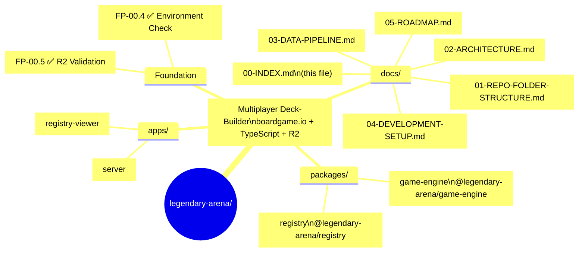

# Legendary Arena — Documentation Index

> A modern multiplayer evolution of the Marvel Legendary deck-building card game.  
> Built with **boardgame.io**, **TypeScript**, **Cloudflare R2**, and **PostgreSQL**.

**Status:** Foundation complete • Work Packets in progress

---

## 📍 Quick Navigation

- [Repository Structure](01-REPO-FOLDER-STRUCTURE.md)
- [System Architecture](02-ARCHITECTURE.md)
- [Data Pipeline](03-DATA-PIPELINE.md)
- [Development Setup](04-DEVELOPMENT-SETUP.md) ← **Start here**
- [Roadmap](05-ROADMAP.md)
- [Roadmap (Mindmap)](05-ROADMAP-MINDMAP.md)

---

## Repository Overview



---

## 📚 Full Documentation Table of Contents

| # | Document | Description |
|---|----------|-------------|
| 00 | [INDEX](00-INDEX.md) | This landing page |
| 01 | [REPO-FOLDER-STRUCTURE](01-REPO-FOLDER-STRUCTURE.md) | Full directory layout |
| 02 | [ARCHITECTURE](02-ARCHITECTURE.md) | Authoritative package boundaries, data flow, persistence rules |
| 03 | [DATA-PIPELINE](03-DATA-PIPELINE.md) | R2 → metadata → validation → PostgreSQL flow |
| 04 | [DEVELOPMENT-SETUP](04-DEVELOPMENT-SETUP.md) | Local development guide (you are here) |
| 05 | [ROADMAP](05-ROADMAP.md) | Current Work Packets & phases |
| 05M | [ROADMAP-MINDMAP](05-ROADMAP-MINDMAP.md) | Visual overview |
| — | [devlog/](devlog/) | Weekly development journal |
| — | [screenshots/](screenshots/) | All UI & validation screenshots |
| — | [ai/](ai/) | AI coordination system, Work Packets, ECs |

---

## Additional Resources

- **Live R2 Data** → [https://images.barefootbetters.com](https://images.barefootbetters.com)
- **Marvel Legendary Universal Rules** → `Marvel Legendary Universal Rules v23 (hyperlinks).pdf`
- **Governance** → `docs/ai/ARCHITECTURE.md` + `docs/ai/DECISIONS.md`

---

**Last updated:** 2026-04-09  
**Maintained by:** Human developer

*This index is the single source of truth for navigating the project documentation.*
```