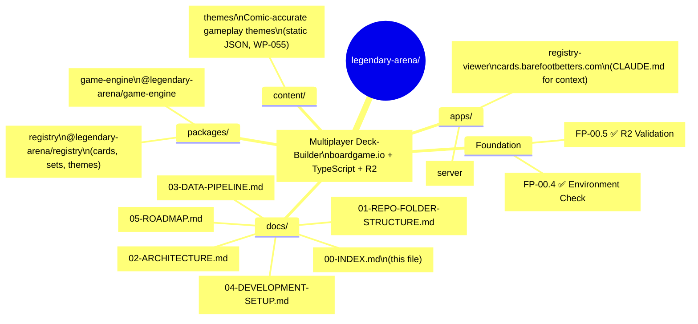

# Legendary Arena — Documentation Index

> A modern multiplayer evolution of the Marvel Legendary deck-building card game.  
> Built with **boardgame.io**, **TypeScript**, **Cloudflare R2**, and **PostgreSQL**.

**Status:** Foundation complete • Core gameplay loop complete (Phase 4) • Card mechanics & abilities complete (Phase 5) • **Phase 6 (Verification, UI & Production) complete — tagged `phase-6-complete` at commit `c376467` on 2026-04-19**: replay + UIState + inspector chain (WP-027/028/063/064/080) plus production-safety stack (WP-031 invariants / WP-032 network / WP-034 versioning `5139817` / WP-035 release-ops playbook `d5935b5` / WP-042 deployment checklists `c964cf4`) plus client surfaces (WP-061/062/065) plus scoring (WP-048/067) all landed • **Post-Phase-6 work (2026-04-20):** WP-056 ✅ pre-planning types-only core at `eade2d0` (new `packages/preplan/` package; D-5601 new `preplan` code category) + WP-081 ✅ registry build pipeline cleanup at `ea5cfdd` (subtractive hygiene; tsc-only build; D-8101 + D-8102; first green `pnpm --filter @legendary-arena/registry build` since WP-003) • Theme data model ready • Registry viewer with keyword/rule tooltips

---

## 📍 Quick Navigation

- [Repository Structure](01-REPO-FOLDER-STRUCTURE.md)
- [System Architecture](02-ARCHITECTURE.md)
- [Data Pipeline](03-DATA-PIPELINE.md)
- [Development Setup](04-DEVELOPMENT-SETUP.md) ← **Start here**
- [Roadmap](05-ROADMAP.md)
- [Roadmap (Mindmap)](05-ROADMAP-MINDMAP.md)

---

## Repository Overview

---

## 📚 Full Documentation Table of Contents

| # | Document | Description |
|---|----------|-------------|
| 00 | [INDEX](00-INDEX.md) | This landing page |
| 01 | [REPO-FOLDER-STRUCTURE](01-REPO-FOLDER-STRUCTURE.md) | Full directory layout |
| 02 | [ARCHITECTURE](02-ARCHITECTURE.md) | Authoritative package boundaries, data flow, persistence rules |
| 03 | [DATA-PIPELINE](03-DATA-PIPELINE.md) | R2 → metadata → validation → PostgreSQL + PAR artifact pipeline |
| 03.1 | [DATA-SOURCES](03.1-DATA-SOURCES.md) | Authoritative input data inventory — provenance, storage, trust model |
| 04 | [DEVELOPMENT-SETUP](04-DEVELOPMENT-SETUP.md) | Local development guide (you are here) |
| 05 | [ROADMAP](05-ROADMAP.md) | Current Work Packets & phases |
| 05M | [ROADMAP-MINDMAP](05-ROADMAP-MINDMAP.md) | Visual overview |
| — | [devlog/](devlog/) | Weekly development journal |
| — | [screenshots/](screenshots/) | All UI & validation screenshots |
| 12 | [SCORING-REFERENCE](12-SCORING-REFERENCE.md) | PAR-based scoring formula & leaderboard rules |
| 12.1 | [PAR-ARTIFACT-INTEGRITY](12.1-PAR-ARTIFACT-INTEGRITY.md) | Why PAR artifacts are hashed (rationale) |
| 13 | [REPLAYS-REFERENCE](13-REPLAYS-REFERENCE.md) | Replay & game saving system (governance reference) |
| — | [ai/](ai/) | AI coordination system, Work Packets, ECs |
| — | [ai/work-packets/WORK_INDEX](ai/work-packets/WORK_INDEX.md) | Authoritative Work Packet index — execution order, dependencies, status |
| — | [ai/execution-checklists/EC_INDEX](ai/execution-checklists/EC_INDEX.md) | Execution Checklist index — per-WP contracts plus ad-hoc ECs (R-EC hygiene, EC-101+ viewer series) |
| — | [ai/REFERENCE/02-CODE-CATEGORIES](ai/REFERENCE/02-CODE-CATEGORIES.md) | Code categories — what each file type may do, import rules, failure modes |
| — | [ai/DESIGN-CONSTRAINTS-PREPLANNING](ai/DESIGN-CONSTRAINTS-PREPLANNING.md) | Pre-planning system: problem statement, goal, and 12 design constraints |
| — | [ai/DESIGN-PREPLANNING](ai/DESIGN-PREPLANNING.md) | Pre-planning system: sandbox architecture and data model |
| — | [ai/MOVE_LOG_FORMAT](ai/MOVE_LOG_FORMAT.md) | Definitive replay & verification event schema (forensics report; source of D-0203, D-0204, D-0205 / Gap #4) |
| — | content/themes/ | Comic-accurate gameplay theme definitions (WP-055) |

---

## Additional Resources

- **Live R2 Data** → [https://images.barefootbetters.com](https://images.barefootbetters.com)
- **Marvel Legendary Universal Rules** → `Marvel Legendary Universal Rules v23 (hyperlinks).pdf`
- **Governance** → `docs/ai/ARCHITECTURE.md` + `docs/ai/DECISIONS.md`
- **Theme Data Model** → `docs/ai/work-packets/WP-055-theme-data-model.md`
- **Keyword & Rule Glossary** → `docs/ai/work-packets/WP-060-keyword-rule-glossary-data.md`
- **Registry Viewer** → `apps/registry-viewer/CLAUDE.md` (architecture) + `HISTORY-modern-master-strike.md` (predecessor)

---

**Last updated:** 2026-04-20 (Post-Phase-6 hygiene + Phase 7 entry — **WP-056** ✅ pre-planning types-only core at `eade2d0` (new `packages/preplan/` package; D-5601 new `preplan` code category; RS-2 zero-test lock) + **WP-081** ✅ registry build pipeline cleanup at `ea5cfdd` (3 broken scripts deleted + tsc-only build; D-8101 delete-not-rewrite + D-8102 single-CI-validate-step). Engine baseline 436/109/0 UNCHANGED through both; repo-wide 536/0 UNCHANGED. Prior Phase 6 state retained: tag `phase-6-complete` at `c376467` published 2026-04-19; 19 WPs landed; WP-042.1 deferred per D-4201 and WP-066 unreviewed carried forward to Phase 7 backlog)
**Maintained by:** Human developer

*This index is the single source of truth for navigating the project documentation.*