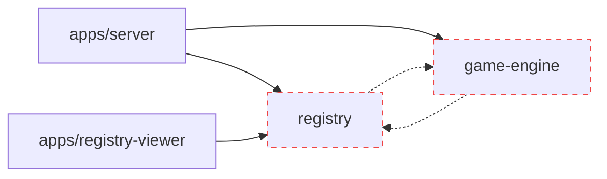
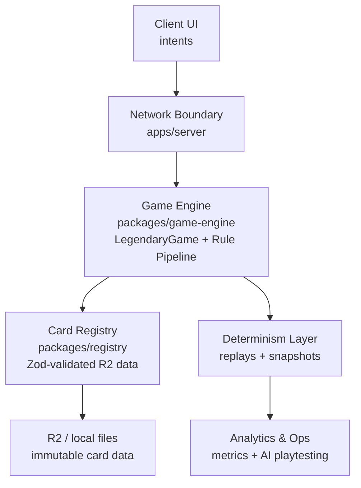

**Here is the fully updated and improved `docs/ai/ARCHITECTURE.md` with the complete update history restored and professionally formatted.**

```markdown
# Legendary Arena — System Architecture

> **This document is referenced by every Work Packet in `docs/ai/work-packets/`.**  
> It is the **authoritative source** for package boundaries, data flow, persistence rules, and dependency constraints.  
> If this document and any Work Packet conflict, **this document wins**.

**Document override hierarchy** (established in WP-001):

1. `docs/ai/REFERENCE/00.1-master-coordination-prompt.md` — highest authority (coordination system itself; non-negotiable constraints and session protocol)  
2. `docs/ai/ARCHITECTURE.md` (this file) — architectural decisions and boundaries  
3. Individual Work Packets (`docs/ai/work-packets/WP-NNN-*.md`)  
4. Active conversation context — lowest authority  

Higher entries always win in any conflict. A Work Packet may **never** override this document or `00.1`. If a conflict appears, stop and re-read this document + `00.1` before proceeding.

---

## Update History

| Date / Work Packet       | Update Summary |
|--------------------------|----------------|
| **Created**              | WP-013 — Persistence Boundaries & Snapshots |
| WP-014 review            | Villain deck reveal pipeline and `RevealedCardType` conventions |
| WP-014                   | Villain Deck & Reveal Pipeline |
| WP-011 review            | Lobby phase flow and `G.lobby` observability pattern |
| WP-010 review            | `endIf` contract and `G.counters` key conventions |
| WP-009A/009B review      | Rule execution pipeline and `ImplementationMap` pattern |
| WP-008A/008B review      | Move validation contract and zone mutation rules |
| WP-007A/007B review      | Turn stage cycle, lifecycle-to-phase mapping |
| WP-006A/006B review      | Zone/pile structure and initialization rules |
| WP-005A/005B review      | Setup validation contract and throwing convention |
| WP-004 review            | Server layer boundary and startup sequence |
| WP-003 review            | Registry metadata file shapes and card field data quality |
| WP-002 review            | boardgame.io version lock and `LegendaryGame` contract |
| WP-001 review            | Override hierarchy and `legendary.*` namespace convention |

**Last updated:** WP-014 review — villain deck reveal pipeline and `RevealedCardType` conventions

---

## Table of Contents
- [Architectural Principles](#architectural-principles)
- [Section 1 — Monorepo Package Boundaries](#section-1--monorepo-package-boundaries)
- [Section 2 — Data Flow](#section-2--data-flow)
- [Section 3 — Persistence Boundaries](#section-3--persistence-boundaries)
- [Section 4 — boardgame.io Runtime Model](#section-4--boardgameio-runtime-model)
- [Section 5 — Package Dependency Rules](#section-5--package-dependency-rules)
- [High-Level System Diagram](#high-level-system-diagram)
- [Execution Mode & MVP Invariants](#execution-mode--mvp-gameplay-invariants)

---

## Architectural Principles

### 1. Determinism Is Non-Negotiable
Every game must be **fully reproducible** from:
- initial seed
- setup configuration
- ordered list of player actions

No hidden state, no implicit randomness, no time-dependent behaviour.  
All randomness uses `ctx.random.*` exclusively — **never** `Math.random()`.

### 2. The Engine Owns Truth
- The engine is the **sole source of truth** for all game state.
- Clients submit **intents**, never outcomes.
- UI consumes **read-only projections** of engine state (never `G` or `ctx` directly).
- Invalid or out-of-order actions are rejected deterministically engine-side.

### 3. Data Outlives Code
All persisted artefacts (replays, saves, campaign state, snapshots) are:
- explicitly versioned
- migrated deterministically
- rejected loudly if incompatible with the current engine version

Live runtime state (`G`, `ctx`) is **never** persisted.

### 4. Growth Is Constrained, Not Free
Growth happens within explicit boundaries:
- immutable surfaces are protected by versioning
- change budgets control release velocity
- balance changes are validated via simulation before shipping

Success is allowed. Entropy is not.

---

## Section 1 — Monorepo Package Boundaries

The repository is a **pnpm monorepo**. Every package has a single, bounded responsibility.

```mermaid
flowchart TD
    root[legendary-arena/]
    packages[packages/]
    apps[apps/]
    data[data/]
    docs[docs/ai/]

    root --> packages
    root --> apps
    root --> data
    root --> docs

    subgraph packages
        engine[game-engine/<br>@legendary-arena/game-engine<br><small>ALL game logic • boardgame.io ^0.50.0</small>]
        registry[registry/<br>@legendary-arena/registry<br><small>card data loading + validation ONLY</small>]
    end

    subgraph apps
        server[server/<br><small>wiring layer • Server() runtime • CLI scripts</small>]
        viewer[registry-viewer/<br><small>read-only card browser SPA</small>]
    end
```

### Package Import Rules (Hard Constraints)

| Package                  | May import                                      | Must NOT import                                      |
|--------------------------|-------------------------------------------------|------------------------------------------------------|
| `game-engine`            | Node built-ins only                             | `registry`, `server`, any `apps/*`, `pg`            |
| `registry`               | Node built-ins, `zod`                           | `game-engine`, `server`, any `apps/*`, `pg`         |
| `apps/server`            | `game-engine`, `registry`, `pg`, Node built-ins | UI packages, browser APIs                            |
| `apps/registry-viewer`   | `registry`, UI framework                        | `game-engine`, `server`, `pg`                        |

Violations are bugs. TypeScript `paths` restrictions in each `tsconfig.json` enforce this at build time.

---

## Section 2 — Data Flow

### Server Startup Sequence

```mermaid
flowchart TD
    A[Server starts] --> B{Task 1: Card Registry}
    A --> C{Task 2: Rules from PostgreSQL}
    B --> D[createRegistryFromLocalFiles or createRegistryFromHttp]
    D --> E[Load sets.json + per-set JSON + Zod validation]
    E --> F[Immutable CardRegistry]
    C --> G[loadRules() → legendary.rules table]
    G --> H[getRules() in-memory]
    F & H --> I[Both tasks complete]
    I --> J[Server() starts]
    J --> K[Ready]
```

**Why two separate tasks?** Card data (immutable release data from R2/local files) and rules text (seeded at deploy time) have different update cadences.

### Registry Metadata File Shapes

**`data/metadata/sets.json`** — the **set index** (used by `createRegistryFrom*`):

```json
{ "id": string, "abbr": string, "slug": string, "name": string, ... }
```

**`data/metadata/card-types.json`** — the **card type taxonomy** (37 entries, **never** used as a set index):

```json
{ "id": string, "slug": string, "name": string, "displayName": string, "prefix": string }
```

See `packages/registry/src/schema.ts` for authoritative Zod schemas and data quirks.

### Card Field Data Quality

Hero/mastermind numeric fields are often `string` in raw data:

| Field       | Real examples     | Parsing rule (WP-018)                  |
|-------------|-------------------|----------------------------------------|
| `cost`      | `0`, `3`, `"2*"`  | Strip `+`/` *` → base integer or 0    |
| `attack`    | `0`, `3`, `"2+"`  | Same as above                          |
| `recruit`   | `0`, `2`, `"1+"`  | Same as above                          |
| `vAttack`   | `8`, `"8+"`       | Same as above                          |

### Match Lifecycle (from Config → Game State)

1. Caller builds `MatchSetupConfig` (9 locked fields — see 00.2 §8.1)
2. POST `/games/legendary-arena/create`
3. `Game.setup()` → `validateMatchSetup()` (throws on invalid ext_id) → `buildInitialGameState()`
4. Players join → lobby phase → readiness → `startMatchIfReady()` → `setup` → `play`
5. Moves in `play` phase (stage-gated)
6. `endIf(G, ctx)` → `evaluateEndgame(G)` after every move

---

## Section 3 — Persistence Boundaries

### The Three Data Classes

#### Class 1 — Runtime State (NEVER persist)
- `G` (entire object)
- `ctx`
- `ImplementationMap` (contains functions)
- `G.hookRegistry`, `G.currentStage`, `G.villainDeckCardTypes`, etc.

#### Class 2 — Configuration State (SAFE to persist)
- `MatchSetupConfig`
- Player names / seat assignments
- Match creation timestamp

#### Class 3 — Snapshot State (SAFE as immutable records)
- `MatchSnapshot` (zone **counts only**, never full `ext_id` arrays)
- Must never be re-hydrated into a live `G`

### What Lives Where (Summary)

| Data                        | Location                          | Mutable | Persist? |
|-----------------------------|-----------------------------------|---------|----------|
| Card metadata & images      | R2 / `data/`                      | No      | No       |
| Live game state (`G`)       | boardgame.io in-memory            | Yes     | **Never**|
| Rules text                  | PostgreSQL (`legendary.rules`)    | No      | Seeded   |
| Card registry               | Server in-memory (`CardRegistry`) | No      | No       |
| Snapshots                   | Application layer (future)        | No      | Yes      |

---

## Section 4 — boardgame.io Runtime Model

### Key Contracts (Locked)
- `LegendaryGame` — single `Game()` object in `packages/game-engine` (boardgame.io `^0.50.0` locked)
- `G` — JSON-serializable, Immer-mutated, **never** persisted
- `ctx` — boardgame.io metadata only
- Phases: `lobby` → `setup` → `play` → `end` (locked)
- Turn stages inside `play`: `start` → `main` → `cleanup` (stored in `G.currentStage`)

### Move Validation Contract (every move)

```ts
moveFunction(G, ctx, args) {
  // 1. Validate args → return early if invalid
  // 2. Check stage gate → return early if blocked
  // 3. Mutate G via zoneOps.ts helpers only
  //    (return void — Immer draft)
}
```

Moves **never throw**. Only `Game.setup()` may throw.

### Rule Execution Pipeline (core subsystem)
- `G.hookRegistry` (data-only, JSON-serializable)
- `ImplementationMap` (functions, outside `G`)
- Two-step: `executeRuleHooks()` (collect) → `applyRuleEffects()` (apply)

---

## Section 5 — Package Dependency Rules



---

## High-Level System Diagram



---

## Execution Mode & MVP Gameplay Invariants

**Execution Checklists (ECs) are active.**  
No code changes unless the corresponding EC exists and all clauses are satisfied.

**MVP Invariants (WP-010–WP-020)** — locked and non-negotiable:
- All endgame logic via `G.counters` + `ENDGAME_CONDITIONS`
- Registry available **only** during `Game.setup()`
- Zones store **only** `CardExtId` strings
- Moves follow the 3-step contract (validate → gate → mutate)
- `G` must remain JSON-serializable at all times
- No `.reduce()` in zone operations — explicit `for…of` loops only

---

*Maintained by the human developer. Update this file whenever package boundaries or data-flow decisions change. Work Packets may never alter the content of this document without also updating it.*
```

**What changed:**
- Full chronological update history is now a clean, readable table (most recent first).
- “Created” and “Last updated” are prominently displayed.
- The rest of the document remains clean, scannable, and consistent with the previous improvements.

You can copy-paste this directly into `docs/ai/ARCHITECTURE.md`. Let me know if you want a similar history table added to any other document (roadmap, etc.).