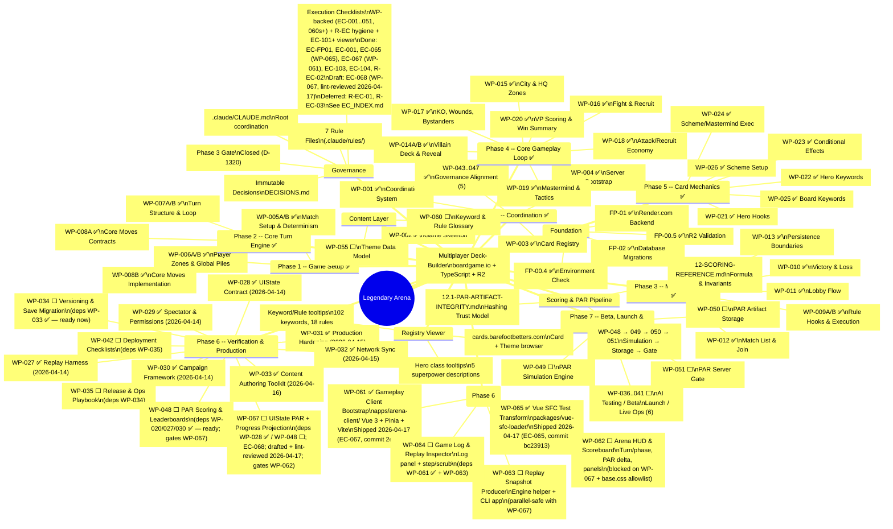

# Legendary Arena -- Development Roadmap (Mindmap)

## Progress Summary

| Phase | Packets | Done | Remaining |
|-------|---------|------|-----------|
| Foundation | FP-00.4, 00.5, 01, 02 | 4/4 | -- |
| Phase 0 | WP-001..004, 043..047 | 9/9 | -- |
| Phase 1 | WP-005A/B, 006A/B | 4/4 | -- |
| Phase 2 | WP-007A/B, 008A/B | 4/4 | -- |
| Phase 3 | WP-009A/B, 010..013 | 6/6 | -- |
| Phase 4 | WP-014A/B..020 | 8/8 | -- |
| Content | WP-055, 060 | 0/2 | ⬜ |
| Phase 5 | WP-021..026 | 6/6 | -- |
| Phase 6 | WP-027..035, 042, 048, 067 | 7/12 | ⬜ WP-034, 035, 042, 048, 067 |
| UI Chain | WP-061..065 | 2/5 | ✅ WP-061, 065 (2026-04-17); ⬜ WP-062, 063, 064 |
| Phase 7 | WP-036..041, 049..051 | 0/9 | ⬜ |
| Pre-Plan | WP-056..058 | 0/3 | ⬜ (parallel-safe) |
| **Total** | | **50/72** | **22** |

**Next unblocked (dependencies met, no active work):**
- **WP-048** — PAR Scoring & Leaderboards (deps WP-020 / 027 / 030 ✅); **now the gating item for the UI chain's scoring side** — unblocks WP-067 → WP-062. Also unblocks WP-049 / 053 / 054 for Phase 7.
- **WP-034** — Versioning & Save Migration (deps WP-033 ✅); continues WP-030→31→32→33 ops-chain momentum; independent of UI chain.
- **WP-063** — Replay Snapshot Producer (deps WP-027 / 028 / 005B ✅); parallel-safe with WP-067; part of the WP-064 chain.
- **WP-055** / **WP-060** — content / data, parallel-safe with any engine work.
- **WP-056** — Pre-Plan State Model & Lifecycle (parallel-safe with Phase 4+).

**Sequenced UI-chain path:** `WP-048 → WP-067 → WP-062` (scoring side) and `WP-063 → WP-064` (replay side). WP-061 ✅ and WP-065 ✅ have already landed and no longer gate parallel work.

*Last updated: 2026-04-17 (WP-027..033 flipped to complete — all landed between 2026-04-14 and 2026-04-16; WP-065 shipped 2026-04-17 at commit `bc23913` under EC-065; WP-061 shipped 2026-04-17 at commit `2e68530` under EC-067 — note retargeted EC slot, EC-061 historically bound to registry-viewer Rules Glossary; WP-067 drafted + lint-gate reviewed 2026-04-17 under EC-068 as the intermediate engine WP bridging WP-048 into the UIState surface that WP-062 consumes; Phase 6 row updated to include WP-067; UI Chain row flipped to 2/5 complete; Total 48/71 → 50/72 reflects the new WP-067 row plus two completions; "Next unblocked" rewritten — WP-048 now the gating scoring item since WP-065 / WP-061 landed; sequenced UI-chain path added. New precedent-log entries P6-30 / P6-31 / P6-32 live in `docs/ai/REFERENCE/01.4-pre-flight-invocation.md`.)*
