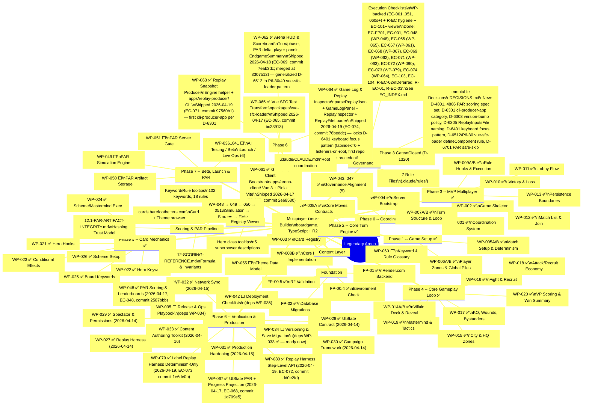

# Legendary Arena -- Development Roadmap (Mindmap)

## Progress Summary

| Phase | Packets | Done | Remaining |
|-------|---------|------|-----------|
| Foundation | FP-00.4, 00.5, 01, 02 | 4/4 | -- |
| Phase 0 | WP-001..004, 043..047 | 9/9 | -- |
| Phase 1 | WP-005A/B, 006A/B | 4/4 | -- |
| Phase 2 | WP-007A/B, 008A/B | 4/4 | -- |
| Phase 3 | WP-009A/B, 010..013 | 6/6 | -- |
| Phase 4 | WP-014A/B..020 | 8/8 | -- |
| Content | WP-055, 060 | 0/2 | ⬜ |
| Phase 5 | WP-021..026 | 6/6 | -- |
| Phase 6 | WP-027..035, 042, 048, 067, 079, 080 | 11/14 | ⬜ WP-034, 035, 042 |
| UI Chain | WP-061..065 | 5/5 | ✅ all (WP-061, 062, 063, 064, 065) |
| Phase 7 | WP-036..041, 049..051 | 0/9 | ⬜ |
| Pre-Plan | WP-056..058 | 0/3 | ⬜ (parallel-safe) |
| **Total** | | **57/74** | **17** |

**Next unblocked (dependencies met, no active work):**
- **WP-034** — Versioning & Save Migration (deps WP-033 ✅); continues WP-030→31→32→33 ops-chain momentum.
- **WP-055** / **WP-060** — content / data, parallel-safe with any engine work.
- **WP-056** — Pre-Plan State Model & Lifecycle (parallel-safe with Phase 4+).

**Ops chain path:** `WP-034 → WP-035 → WP-042` is the next sequenced workstream (versioning → release/ops playbook → deployment checklists). UI Chain is now **5/5 complete** — both the scoring side (WP-048 → WP-067 → WP-062) and the replay side (WP-079 → WP-080 → WP-063 → WP-064) landed.

*Last updated: 2026-04-19 (correction pass — discovered three WPs were stale-marked ⬜ in the prior 2026-04-19 update despite WORK_INDEX showing them ✅: **WP-048** ✅ at commit `2587bbb` under EC-048 (2026-04-17), **WP-067** ✅ at commit `1d709e5` under EC-068 (2026-04-17), **WP-062** ✅ at commit `7eab3dc` under EC-069 (2026-04-18, merged at `3307b12`). Root cause: prior update worked from a stale 2026-04-17 footer + an untracked pre-execution `session-context-wp048.md` file rather than re-checking WORK_INDEX `[x]` lines. Phase 6 row now 11/14, UI Chain 5/5 (was 4/5), Total 54/74 → 57/74. "Next unblocked" reduced — WP-048/067/062 removed; WP-034 the next ops-chain item. Prior 2026-04-19 history preserved: WP-079 ✅ at `1e6de0b` under EC-073, WP-080 ✅ at `dd0e2fd` under EC-072, WP-063 ✅ at `97560b1` under EC-071, WP-064 ✅ at `76beddc` under EC-074 with new D-6401 keyboard focus pattern. New precedent-log entries P6-43–P6-49 live in `docs/ai/REFERENCE/01.4-pre-flight-invocation.md`.)*
