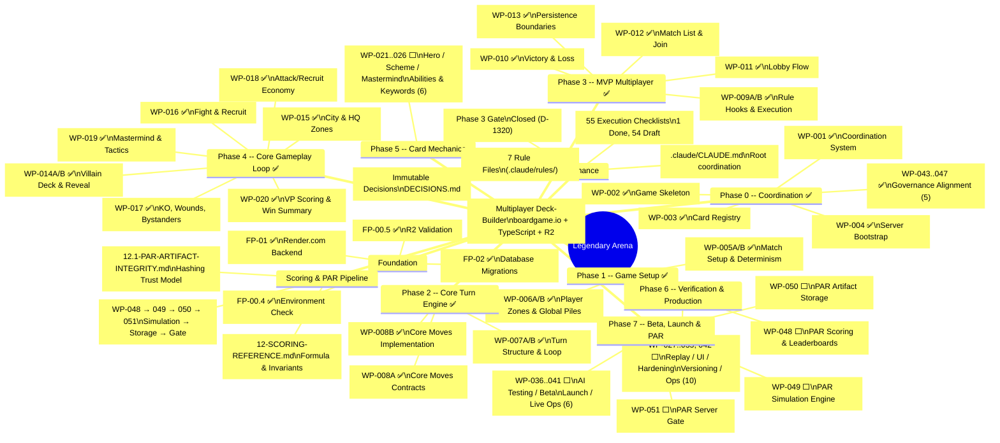

# Legendary Arena -- Development Roadmap (Mindmap)

## Progress Summary

| Phase | Packets | Done | Remaining |
|-------|---------|------|-----------|
| Foundation | FP-00.4, 00.5, 01, 02 | 4/4 | -- |
| Phase 0 | WP-001..004, 043..047 | 9/9 | -- |
| Phase 1 | WP-005A/B, 006A/B | 4/4 | -- |
| Phase 2 | WP-007A/B, 008A/B | 4/4 | -- |
| Phase 3 | WP-009A/B, 010..013 | 6/6 | -- |
| Phase 4 | WP-014A/B..020 | 8/8 | -- |
| Phase 5 | WP-021..026 | 0/6 | ⬜ |
| Phase 6 | WP-027..035, 042, 048 | 0/11 | ⬜ |
| Phase 7 | WP-036..041, 049..051 | 0/9 | ⬜ |
| **Total** | | **35/60** | **25** |

**Next unblocked:** WP-021 (Hero Card Text & Keywords)

*Last updated: 2026-04-12 (Phase 4 complete, 247 tests passing)*
