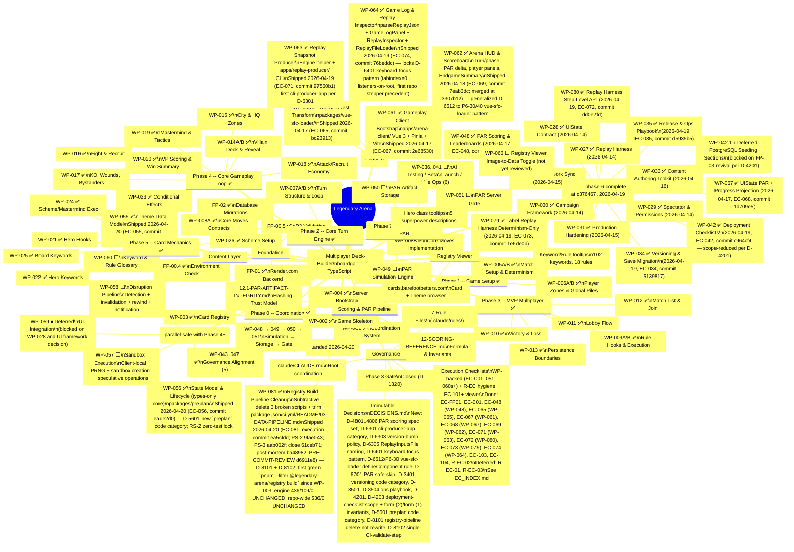

# Legendary Arena -- Development Roadmap (Mindmap)

## Progress Summary

| Phase | Packets | Done | Remaining |
|-------|---------|------|-----------|
| Foundation | FP-00.4, 00.5, 01, 02 | 4/4 | -- |
| Phase 0 | WP-001..004, 043..047 | 9/9 | -- |
| Phase 1 | WP-005A/B, 006A/B | 4/4 | -- |
| Phase 2 | WP-007A/B, 008A/B | 4/4 | -- |
| Phase 3 | WP-009A/B, 010..013 | 6/6 | -- |
| Phase 4 | WP-014A/B..020 | 8/8 | -- |
| Content | WP-055, 060 | **1/2** | ⬜ WP-060 |
| Phase 5 | WP-021..026 | 6/6 | -- |
| Phase 6 | WP-027..035, 042, 048, 067, 079, 080 | **14/14** ✅ | — (tagged `phase-6-complete` at `c376467`) |
| UI Chain | WP-061..065 | 5/5 | ✅ all (WP-061, 062, 063, 064, 065) |
| Phase 7 | WP-036..041, 049..051 | 0/9 | ⬜ |
| Pre-Plan | WP-056..058 | **1/3** | ⬜ WP-057, WP-058 (WP-059 deferred; parallel-safe) |
| Post-Phase-6 Hygiene | WP-081 | **1/1** | — (landed 2026-04-20) |
| Carry-forward | WP-042.1, WP-066 | 0/2 | ⏸ WP-042.1 blocked on FP-03 revival per D-4201; ⬜ WP-066 standalone registry-viewer feature (not yet reviewed) |
| **Total** | | **63/76** | **13** (plus 2 carry-forward) |

**Phase 6 closed on 2026-04-19 — tag `phase-6-complete` at `c376467`.** Engine baseline 436/109/0; repo-wide 536/0 (post-WP-055 test count; was 526/0 at Phase 6 close).

**Next unblocked (dependencies met, no active work):**
- **Phase 7 entry (main sequence):** WP-036 (AI Playtesting) → WP-037..041; WP-049..051 (PAR Simulation/Storage/Gate).
- **WP-060** — keyword & rule glossary, parallel-safe with any engine work.
- **WP-057** — Pre-Plan Sandbox Execution (unblocked by WP-056 landing 2026-04-20).
- **WP-058** — Pre-Plan Disruption Pipeline (after WP-057).
- **Carry-forward backlog:** WP-042.1 (unblocks when Foundation Prompt 03 is revived), WP-066 (independent UI feature).
- **Known OOS follow-up (not yet a WP):** trim `packages/registry/.env.example` lines 13-17 + clean `upload-r2.ts` stale docstring and closing `console.log` references — explicitly OOS per WP-081 §Scope (Out); harmless at runtime but misleading. Can be bundled as a single operator-tooling cleanup WP.

**Ops chain closed:** `WP-034 → WP-035 → WP-042` landed sequentially on 2026-04-19 (`5139817` → `d5935b5` → `c964cf4`) and the phase was governance-closed at `c376467`. Both the scoring side (WP-048 → WP-067 → WP-062) and the replay side (WP-079 → WP-080 → WP-063 → WP-064) also landed. **All three Phase 6 sub-chains shipped within 24 hours on 2026-04-19.**

**Post-Phase-6 delivery (2026-04-20):** three more WPs landed on the governance trunk after the `phase-6-complete` tag — WP-055 (content), WP-056 (pre-planning types), WP-081 (registry build hygiene) — all without reopening Phase 6. Engine baseline held at 436/109/0 through all three; repo-wide went 526 → 536 on WP-055 (ten new theme-schema tests) and held at 536 through WP-056 and WP-081 (both zero-test).

*Last updated: 2026-04-20 (**Post-Phase-6 content + pre-planning + hygiene pass** — three WPs landed 2026-04-20 on the governance-trunk branch chain: WP-055 content, WP-056 pre-planning types-only core, WP-081 build-hygiene. **WP-055** ✅ at `dc7010e` under EC-055 — `ThemeDefinitionSchema` + sub-schemas; 10 new theme-schema tests; registry 3→13, repo-wide 526→536. **WP-056** ✅ at `eade2d0` under EC-056 — new `packages/preplan/` package (types-only core: `PrePlan` + `PrePlanSandboxState` + `RevealRecord` + `PrePlanStep`); D-5601 new `preplan` code category; RS-2 zero-test lock; engine consumed via `import type` only; 536/0 UNCHANGED. **WP-081** ✅ at `ea5cfdd` under EC-081 — subtractive cleanup: 3 deletions + 4 modifications (`package.json`, `ci.yml`, `docs/03-DATA-PIPELINE.md`, `README.md`); D-8101 delete-not-rewrite + D-8102 single-CI-validate-step; first green `pnpm --filter @legendary-arena/registry build` since WP-003; 01.6 post-mortem (verdict WP COMPLETE) + PRE-COMMIT-REVIEW retrospective artifact (verdict Safe to commit as-is); 536/0 UNCHANGED. Pre-Plan row bumped 0/3 → 1/3. Content row bumped 0/2 → 1/2. New row "Post-Phase-6 Hygiene" 1/1 added. Total 60/74 → 63/76. Phase 6 tag `phase-6-complete` at `c376467` still stands — post-tag work is hygiene + Phase 7 entry, does not retroactively reopen Phase 6. Prior 2026-04-19 Phase 6 closure history preserved: ops chain WP-034 → WP-035 → WP-042, replay sub-chain WP-027 → WP-079 → WP-080 → WP-063 → WP-064, scoring side WP-048 → WP-067 → WP-062. Precedent-log entries through P6-51 live in `docs/ai/REFERENCE/01.4-pre-flight-invocation.md`.)*
