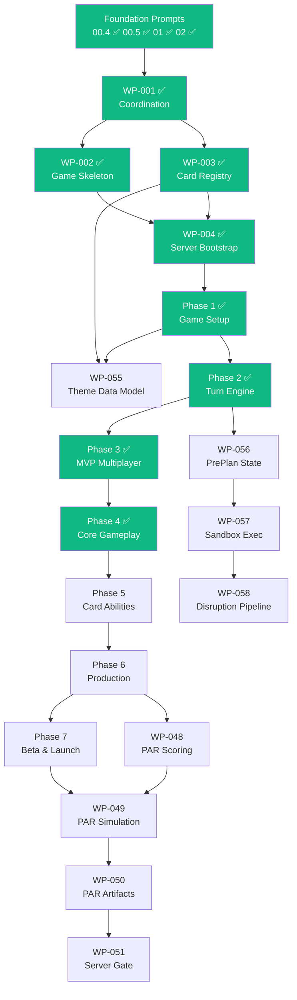

# Legendary Arena -- Development Roadmap

> A modern multiplayer evolution of the Marvel Legendary deck-building card game.
> Built with **boardgame.io**, **TypeScript**, and **Cloudflare R2**.

**Last updated:** 2026-04-12 (Phase 4 complete, Pre-Planning WPs 056-058 added) -- **Authoritative source:** [`docs/ai/work-packets/WORK_INDEX.md`](ai/work-packets/WORK_INDEX.md)

---

## Current Status

**Foundation Prompts**
`00.4` ✅ `00.5` ✅ `01` ✅ `02` ✅

**Work Packets**
`WP-001` ✅ `WP-002` ✅ `WP-003` ✅ `WP-004` ✅ `WP-005A` ✅ `WP-005B` ✅ `WP-006A` ✅ `WP-006B` ✅ `WP-007A` ✅ `WP-007B` ✅ `WP-008A` ✅ `WP-008B` ✅ `WP-009A` ✅ `WP-009B` ✅ `WP-010` ✅ `WP-011` ✅ `WP-012` ✅ `WP-013` ✅ `WP-014A` ✅ `WP-014B` ✅ `WP-015` ✅ `WP-016` ✅ `WP-017` ✅ `WP-018` ✅ `WP-019` ✅ `WP-020` ✅ `WP-043` ✅ `WP-044` ✅ `WP-045` ✅ `WP-046` ✅ `WP-047` ✅ -- `WP-055` ⬜ `WP-056` ⬜ `WP-057` ⬜ `WP-058` ⬜ -- **WP-021..054** ⬜

**Overall Progress**
35 / 60 items complete (4 FPs + 31 WPs) -- **Next up:** WP-021 (Hero Card Text & Keywords)

---

## Foundation Layer

Infrastructure that everything else builds on.

| #       | Name                                | What It Establishes                                | Status      |
|---------|-------------------------------------|----------------------------------------------------|-------------|
| FP-00.4 | Connection & Environment Health Check | `pnpm check` / `pnpm check:env`                 | ✅ Complete |
| FP-00.5 | R2 Data & Image Validation          | `pnpm validate` -- 4-phase integrity check (40 sets) | ✅ Complete |
| FP-01   | Render.com Backend                  | Server scaffold, PostgreSQL, `render.yaml`         | ✅ Complete |
| FP-02   | Database Migrations                 | Migration runner + seed pipeline                   | ✅ Complete |

---

## Phase 0 -- Coordination & Contracts ✅

Establishes repo-as-memory system and locks contracts.

| WP      | Name                             | Layer              | What It Produces                               | Status      |
|---------|----------------------------------|--------------------|-------------------------------------------------|-------------|
| 001     | Foundation & Coordination System | Documentation      | REFERENCE docs, WORK_INDEX, override hierarchy  | ✅ Complete |
| 002     | boardgame.io Game Skeleton       | Game Engine        | `LegendaryGame`, 4 phases, `validateSetupData`  | ✅ Complete |
| 003     | Card Registry Verification       | Registry           | Fix 2 defects + smoke test                      | ✅ Complete |
| 004     | Server Bootstrap                 | Server             | Wire engine + registry into `Server()`           | ✅ Complete |
| 043-047 | Governance Packets               | Docs / Coordination| Align all foundation prompts with framework      | ✅ Complete |

---

## Phase 1 -- Game Setup Contracts & Determinism ✅

Defines *what* a match is before *how* it plays.

| WP     | Name                             | Layer   | What It Produces                                  | Status      |
|--------|----------------------------------|---------|----------------------------------------------------|-------------|
| 005A/B | Match Setup & Deterministic Init | Engine  | `MatchSetupConfig`, `shuffleDeck`, `Game.setup()`  | ✅ Complete |
| 006A/B | Player State & Zones             | Engine  | `PlayerZones`, `GlobalPiles`, validators            | ✅ Complete |

---

## Content Layer -- Theme Data Model

Engine-agnostic content contracts. Parallel-safe with Phase 2+.

| WP  | Name             | Layer    | What It Produces                                         | Status |
|-----|------------------|----------|----------------------------------------------------------|--------|
| 055 | Theme Data Model | Registry | `ThemeDefinition` Zod schema, `content/themes/`, examples | ⬜ Ready |

Themes are curated mastermind/scheme/villain/hero combinations recreating
iconic Marvel storylines. WP-055 defines the schema and validation only --
loading, referential integrity, and projection into `MatchSetupConfig` land
as scope items in the first WP that consumes themes at runtime (UI, setup,
etc.), not as standalone packets.

---

## Pre-Planning System (Parallel-Safe with Phase 4+)

Sandboxed speculative planning for waiting players. Reduces multiplayer
downtime by eliminating mental backtracking when inter-player effects
disrupt pre-planned turns.

| WP  | Name                     | Layer    | What It Produces                                    | Status |
|-----|--------------------------|----------|-----------------------------------------------------|--------|
| 056 | State Model & Lifecycle  | Pre-Plan | `PrePlan` types, lifecycle invariants, `packages/preplan/` | ⬜ Ready |
| 057 | Sandbox Execution        | Pre-Plan | PRNG, sandbox creation, speculative operations       | ⬜ Ready |
| 058 | Disruption Pipeline      | Pre-Plan | Detection, invalidation, rewind, notification        | ⬜ Ready |
| 059 | UI Integration           | UI       | Client wiring, notification rendering                | ⏸ Deferred |

WP-059 is deferred until WP-028 (UI State Contract) and a UI framework
decision. Integration guidance in `docs/ai/DESIGN-PREPLANNING.md` §11.

Design docs:
[`DESIGN-CONSTRAINTS-PREPLANNING.md`](ai/DESIGN-CONSTRAINTS-PREPLANNING.md) |
[`DESIGN-PREPLANNING.md`](ai/DESIGN-PREPLANNING.md)

---

## Phase 2 -- Core Turn Engine ✅

First playable (but incomplete) game loop.

| WP     | Name                 | Layer   | What It Produces                       | Status      |
|--------|----------------------|---------|----------------------------------------|-------------|
| 007A/B | Turn Structure & Loop | Engine | `MATCH_PHASES`, `advanceTurnStage`      | ✅ Complete |
| 008A   | Core Moves Contracts | Engine  | `MoveResult`, `MOVE_ALLOWED_STAGES`, validators | ✅ Complete |
| 008B   | Core Moves Implementation | Engine | `drawCards`, `playCard`, `endTurn` mutations | ✅ Complete |

---

## Phase 3 -- MVP Multiplayer Infrastructure ✅

Minimum viable multiplayer loop. Phase 3 exit gate closed 2026-04-11
(D-1320). All five exit criteria pass: determinism under concurrency,
intent validation, snapshot integrity, engine/server separation, and
failure mode behavior.

| WP      | Name                       | Layer   | What It Produces                            | Status      |
|---------|----------------------------|---------|----------------------------------------------|-------------|
| 009A/B  | Rule Hooks                 | Engine  | 5 triggers, 4 effect types, execution pipeline | ✅ Complete |
| 010     | Victory & Loss Conditions  | Engine  | `evaluateEndgame`, `ENDGAME_CONDITIONS`       | ✅ Complete |
| 011     | Match Creation & Lobby     | Engine  | `LobbyState`, `setPlayerReady`, `startMatchIfReady` | ✅ Complete |
| 012     | Match Listing & Join       | Server  | `list-matches.mjs`, `join-match.mjs` CLI scripts | ✅ Complete |
| 013     | Persistence Boundaries     | Engine  | `PERSISTENCE_CLASSES`, `MatchSnapshot`, `createSnapshot` | ✅ Complete |

---

## Phase 4 -- Core Gameplay Loop ✅

The game finally plays like Legendary. Full MVP combat loop: setup →
play cards → fight villains → recruit heroes → fight mastermind →
endgame → VP scoring. 247 tests passing.

| WP      | Name                                  | Layer   | What It Produces                                       | Status      |
|---------|---------------------------------------|---------|--------------------------------------------------------|-------------|
| 014A    | Villain Reveal & Trigger Pipeline     | Engine  | `revealVillainCard`, card type classification           | ✅ Complete |
| 014B    | Villain Deck Composition              | Engine  | `buildVillainDeck`, henchman/scheme/mastermind cards    | ✅ Complete |
| 015     | City & HQ Zones                       | Engine  | `G.city`, `G.hq`, `pushVillainIntoCity`, escapes       | ✅ Complete |
| 016     | Fight & Recruit Moves                 | Engine  | `fightVillain`, `recruitHero` (no resource gating)     | ✅ Complete |
| 017     | KO, Wounds & Bystander Capture        | Engine  | `G.ko`, `gainWound`, bystander attach/award/resolve    | ✅ Complete |
| 018     | Attack & Recruit Point Economy        | Engine  | `G.turnEconomy`, `G.cardStats`, resource-gated moves   | ✅ Complete |
| 019     | Mastermind Fight & Tactics            | Engine  | `G.mastermind`, `fightMastermind`, victory trigger      | ✅ Complete |
| 020     | VP Scoring & Win Summary              | Engine  | `computeFinalScores`, per-player VP breakdowns          | ✅ Complete |

---

## Phase 5 -- Card Mechanics & Abilities

Individual cards come alive.

| WP      | Name                          | Layer   | What It Produces                      |
|---------|-------------------------------|---------|----------------------------------------|
| 021-026 | Hero Hooks through Scheme Setup | Engine | Abilities, keywords, board rules      |

---

## Phase 6 -- Verification, UI & Production

Making the game safe to ship.

| WP           | Name                                | Layer          | What It Produces                               |
|--------------|--------------------------------------|----------------|-------------------------------------------------|
| 027-035, 042 | Replay through Deployment Checklists | Engine + Ops   | Determinism, UIState, versioning, ops playbook  |
| 048          | PAR Scenario Scoring & Leaderboards  | Engine Scoring | ScenarioKey, ScoreBreakdown, LeaderboardEntry   |

---

## Phase 7 -- Beta, Launch & Live Ops

Ship it, score it, keep it alive.

| WP      | Name                                  | Layer              | What It Produces                              |
|---------|---------------------------------------|---------------------|-----------------------------------------------|
| 036-041 | AI Playtesting through Architecture Audit | Simulation + Ops | Beta strategy, metrics, growth governance      |
| 049     | PAR Simulation Engine                 | Tooling / Simulation | T2 heuristic AI, PAR aggregation, policy tiers |
| 050     | PAR Artifact Storage & Indexing       | Tooling / Data       | Immutable versioned artifacts, index, validation |
| 051     | PAR Publication & Server Gate         | Server / Enforcement | Pre-release gate, fail-closed competitive check |

---

## Scoring & PAR Pipeline

The competitive scoring system spans multiple phases and layers:

```
Scoring Reference (12-SCORING-REFERENCE.md)
  ↓
WP-048: Scoring contracts (Engine)
  ↓
WP-049: Simulation calibration (Tooling) ← WP-036 (AI framework)
  ↓
WP-050: Immutable artifact storage (Data)
  ↓
WP-051: Server gate enforcement (Server)
  ↓
Competitive Leaderboards
```

Key documents: `docs/12-SCORING-REFERENCE.md`, `docs/12.1-PAR-ARTIFACT-INTEGRITY.md`

---

## Dependency Overview



**Parallel-safe packets:** WP-003 (alongside 002), WP-005A/B (no dep on 004), WP-030 (parallel to 031), WP-056/057/058 (parallel with Phase 4+).

---

## Architectural Invariants

- Determinism is non-negotiable -- randomness only via `ctx.random.*`
- Engine owns truth -- clients send intents, never outcomes
- `G` is never persisted -- only `MatchSnapshot` is saved
- Moves never throw -- only `Game.setup()` is allowed to
- Zones store only `CardExtId` strings
- Every phase/transition has a `// why:` comment
- PAR artifacts are immutable trust surfaces -- write-once, never overwritten
- Scoring semantics are an immutable surface -- no changes without major version bump

---

## Governance System

| Document | Role |
|----------|------|
| `.claude/CLAUDE.md` | Root coordination (loaded every session) |
| `docs/ai/ARCHITECTURE.md` | Architectural decisions & boundaries |
| `docs/ai/work-packets/WORK_INDEX.md` | Execution order & status |
| `.claude/rules/*.md` | 7 layer-specific enforcement rules |
| `docs/ai/execution-checklists/EC-*.md` | 55 execution contracts (1 Done, 54 Draft) |
| `docs/ai/DECISIONS.md` | Immutable decisions |
| `docs/12-SCORING-REFERENCE.md` | PAR scoring formula & leaderboard rules |
| `docs/ai/REFERENCE/03A-PHASE-3-MULTIPLAYER-READINESS.md` | Phase 3 exit gate (closed) |

*Last updated: 2026-04-12 (Phase 4 complete, 247 tests passing, WP-055 added, Pre-Planning WPs 056-058 added)*
