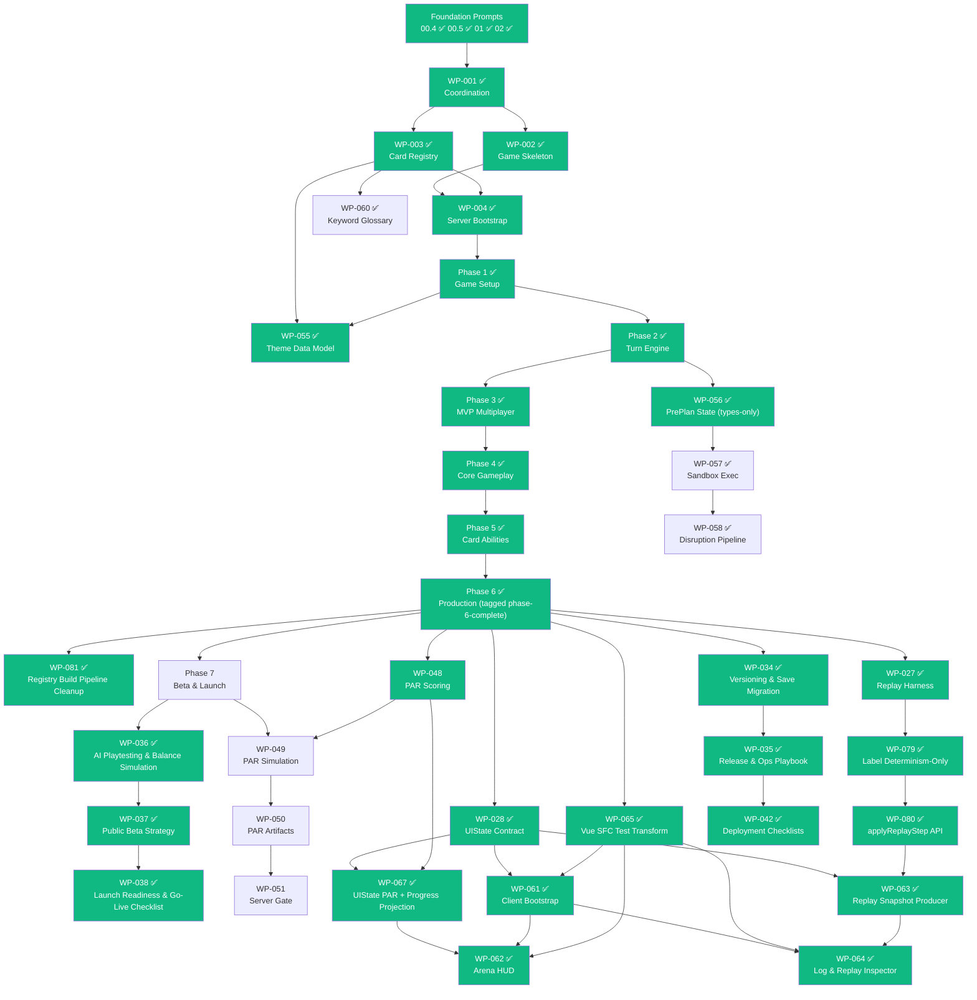

# Legendary Arena -- Development Roadmap

> A modern multiplayer evolution of the Marvel Legendary deck-building card game.
> Built with **boardgame.io**, **TypeScript**, and **Cloudflare R2**.

**Last updated:** 2026-04-22 (**Post-Phase-6 hygiene + Pre-Plan chain + Phase 7 entry**) — **WP-056 landed 2026-04-20 at commit `eade2d0` under EC-056** — pre-planning types-only core: new `packages/preplan/` package (`package.json` + `tsconfig.json` + `src/preplan.types.ts` + `src/index.ts`) exporting four public types (`PrePlan`, `PrePlanSandboxState`, `RevealRecord`, `PrePlanStep`) consumed by WP-057/058 as types only; D-5601 new top-level `preplan` code category; RS-2 zero-test lock; type-only import of `@legendary-arena/game-engine`; no runtime wiring into the engine. **WP-057 landed 2026-04-20 at commit `8a324f0` under EC-057** — pre-plan sandbox execution: first runtime consumer of WP-056 types; client-local Fisher-Yates PRNG (`speculativePrng.ts`), sandbox factory (`preplanSandbox.ts`), five speculative operations (`speculativeOperations.ts`), and `PREPLAN_STATUS_VALUES` canonical readonly array + drift-detection (`preplanStatus.ts`) deferred from WP-056; full-spread aliasing discipline (WP-028 precedent) on every return; uniform null-on-inactive contract; preplan 0/0/0 → 23/4/0; engine 436/109/0 UNCHANGED; governance close `7414656`; 01.6 post-mortem at `docs/ai/post-mortems/01.6-WP-057-preplan-sandbox-execution.md`. **WP-058 landed 2026-04-20 at commit `bae70e7` under EC-058** — pre-plan disruption pipeline: `isPrePlanDisrupted` + `invalidatePrePlan` + `computeSourceRestoration` + `buildDisruptionNotification` + `executeDisruptionPipeline` across `disruption.types.ts` + `disruptionDetection.ts` + `disruptionPipeline.ts`; `PREPLAN_EFFECT_TYPES` canonical readonly array + compile-time drift-check (`preplanEffectTypes.ts`) deferred from WP-056; first implementation of DESIGN-CONSTRAINT #3 ledger-sole rewind authority; first-mutation-wins status guard; preplan 23/4/0 → 52/7/0; engine 436/109/0 UNCHANGED; governance close `00687c5`; A-058-01..05 amendments; 01.6 post-mortem at `docs/ai/post-mortems/01.6-WP-058-preplan-disruption-pipeline.md`. **WP-081 landed 2026-04-20 at commit `ea5cfdd` under EC-081** — subtractive registry build pipeline cleanup: three broken operator scripts deleted (`normalize-cards.ts`, `build-dist.mjs`, `standardize-images.ts`) + `packages/registry/package.json` `scripts.build` trimmed to `"tsc -p tsconfig.build.json"` + one redundant step removed from `.github/workflows/ci.yml` job `build` + six README.md anchor regions rewritten + `docs/03-DATA-PIPELINE.md` "Legacy Scripts" subsection deleted; D-8101 (delete-not-rewrite; no monorepo consumer of old `dist/*.json` artifacts — runtime path is `metadata/sets.json` + `metadata/{abbr}.json` from R2) + D-8102 (`registry:validate` as single CI validation step); first green `pnpm --filter @legendary-arena/registry build` since WP-003 landed; engine 436/109/0 UNCHANGED; repo-wide 536/0 UNCHANGED. Prior history preserved: WP-027..033 landed 2026-04-14/15/16; EC-103/104 landed 2026-04-16/17; WP-065 at `bc23913` under EC-065; WP-061 at `2e68530` under EC-067; **WP-048 landed 2026-04-17 at commit `2587bbb` under EC-048** — PAR scoring infrastructure; **WP-067 landed 2026-04-17 at commit `1d709e5` under EC-068** — UIState PAR breakdown + progress counters with D-6701 safe-skip; **WP-062 landed 2026-04-18 at commit `7eab3dc` under EC-069** (merged at `3307b12`) — Arena HUD component tree; **WP-079 landed 2026-04-19 at commit `1e6de0b` under EC-073** — JSDoc-only narrowing of replay harness as determinism-only per D-0205 follow-up; **WP-080 landed 2026-04-19 at commit `dd0e2fd` under EC-072** — `applyReplayStep` step-level API; **WP-063 landed 2026-04-19 at commit `97560b1` under EC-071** — `ReplaySnapshotSequence` + `apps/replay-producer/` CLI; **WP-064 landed 2026-04-19 at commit `76beddc` under EC-074** — client replay-consumption surface + D-6401 keyboard focus pattern; **WP-034 landed 2026-04-19 at commit `5139817` under EC-034** — `packages/game-engine/src/versioning/` (three version axes + `VersionedArtifact<T>` + `checkCompatibility` / `migrateArtifact` / `stampArtifact`; engine 427→436); **WP-035 landed 2026-04-19 at commit `d5935b5` under EC-035** — `packages/game-engine/src/ops/` engine subtree + `docs/ops/RELEASE_CHECKLIST.md` + `DEPLOYMENT_FLOW.md` + `INCIDENT_RESPONSE.md` (D-3501..D-3504); **WP-042 landed 2026-04-19 at commit `c964cf4` under EC-042** — `docs/ai/deployment/r2-data-checklist.md` (full §A.1–§A.7) + `docs/ai/deployment/postgresql-checklist.md` (scope-reduced to §B.1/§B.2/§B.6/§B.7 per D-4201) + D-4202/D-4203 governance. **Phase 6 tagged `phase-6-complete` at governance-close commit `c376467`** (19 WPs landed; engine 436/109/0; repo-wide 526/0 at phase close; WP-042.1 deferred per D-4201 + WP-066 unreviewed carried forward to Phase 7 backlog). **2026-04-21 delivery wave** (five WPs + one ad-hoc INFRA): **WP-060** ✅ glossary R2 migration at `412a31c` under EC-106 (123 keywords + 20 rules to R2; non-blocking fetch with empty-Map fallback; D-6001..D-6007 including D-6002 historical-neighbor glossary-wiring lock; governance close `cd811eb`); **WP-082** ✅ glossary schema/labels/rulebook deep-links at `752fcca` under EC-107 (first `.strict()` use in `packages/registry/src/schema.ts`; uploads v23-hyperlinks rulebook PDF to R2 at version-pinned URL; required `label` + optional `pdfPage` on every entry; A-082-01 `./schema` subpath export precedent; D-8201..D-8206; +10 registry tests → repo-wide 588 → 596; governance close `0acdf3c`); **EC-110** ad-hoc Validate-Registry CI path fix at `4e53e9f` (not a WP; `validate.ts` defaults via `fileURLToPath(import.meta.url)`; surfaced two upstream data defects repaired via three `INFRA:` commits); **WP-036** ✅ AI playtesting & balance simulation at `539b543` under EC-036 (first Phase-7 WP; D-3601 simulation code category + D-3602 same-pipeline-as-humans + D-3603 random-policy MVP baseline + D-3604 two-independent-PRNG-domain seed reproducibility; A-036-02 amendment; governance close `61df4c0`); **WP-084** ✅ auxiliary-metadata deletion at `b250bf1` under EC-109 (subtractive — five auxiliary Zod schemas + five `data/metadata/*.json` + `card-types-old.json` + Phase-2 validate block + viewer drifted-duplicate `localRegistry.ts` + legacy `Validate-R2-old.ps1` deleted; D-8401..D-8407 including D-8403 `*-old.*` repo-smell rule, D-8406 viewer drifted-duplicate rule, D-8407 legacy-ps1 deletion; 596/0 preserved; A-084-01 amendment; governance close `4cc9ded`); **WP-083** ✅ fetch-time Zod validation at `601d6fc` under EC-108 (adds `ViewerConfigSchema` (`.strict()`) + `ThemeIndexSchema` to `packages/registry/src/schema.ts`; `registryClient` + `themeClient` retrofitted to `.safeParse(...)` at fetch boundary with first-Zod-issue rendering; A-083-04 `./theme.schema` subpath export; D-8301..D-8305; 596/0 preserved; governance close `7f054e1`). **Current baseline: engine 436/109/0 UNCHANGED; repo-wide 596/0.** -- **Authoritative source:** [`docs/ai/work-packets/WORK_INDEX.md`](ai/work-packets/WORK_INDEX.md)

---

## Current Status

**Foundation Prompts**
`00.4` ✅ `00.5` ✅ `01` ✅ `02` ✅

**Work Packets**
`WP-001` ✅ `WP-002` ✅ `WP-003` ✅ `WP-004` ✅ `WP-005A` ✅ `WP-005B` ✅ `WP-006A` ✅ `WP-006B` ✅ `WP-007A` ✅ `WP-007B` ✅ `WP-008A` ✅ `WP-008B` ✅ `WP-009A` ✅ `WP-009B` ✅ `WP-010` ✅ `WP-011` ✅ `WP-012` ✅ `WP-013` ✅ `WP-014A` ✅ `WP-014B` ✅ `WP-015` ✅ `WP-016` ✅ `WP-017` ✅ `WP-018` ✅ `WP-019` ✅ `WP-020` ✅ `WP-021` ✅ `WP-022` ✅ `WP-023` ✅ `WP-024` ✅ `WP-025` ✅ `WP-026` ✅ `WP-027` ✅ `WP-028` ✅ `WP-029` ✅ `WP-030` ✅ `WP-031` ✅ `WP-032` ✅ `WP-033` ✅ `WP-034` ✅ `WP-035` ✅ `WP-036` ✅ `WP-037` ✅ `WP-038` ✅ `WP-042` ✅ `WP-043` ✅ `WP-044` ✅ `WP-045` ✅ `WP-046` ✅ `WP-047` ✅ `WP-048` ✅ `WP-055` ✅ `WP-056` ✅ `WP-057` ✅ `WP-058` ✅ `WP-060` ✅ `WP-061` ✅ `WP-062` ✅ `WP-063` ✅ `WP-064` ✅ `WP-065` ✅ `WP-067` ✅ `WP-079` ✅ `WP-080` ✅ `WP-081` ✅ `WP-082` ✅ `WP-083` ✅ `WP-084` ✅ `WP-085` ✅ -- `WP-042.1` ⏸ (blocked on FP-03 revival per D-4201) `WP-066` ✅ (closed 2026-04-22 at `8c5f28f`) -- **WP-039..041, 049..054** ⬜

**Overall Progress**
72 / 79 items complete (4 FPs + 68 WPs). **Phase 7 launch-readiness trio landed 2026-04-22:** WP-036 ✅ AI playtesting (`539b543`) → WP-037 ✅ public beta strategy (`160d9b9`) → WP-038 ✅ launch readiness & go-live checklist (`2134f33`, governance close `d4fe447`). WP-038 produces `docs/ops/LAUNCH_READINESS.md` (17 binary readiness gates across 4 categories + single launch authority model) + `docs/ops/LAUNCH_DAY.md` (T-1h → T-0 → T+72h timeline + PAUSE-vs-ROLLBACK + 5-field Freeze Exception Record + 4 verbatim rollback triggers); D-3801 / D-3802 / D-3803 governance decisions; documentation-only — engine baseline 444/110/0 + repo-wide 596/0 UNCHANGED through both WP-037 and WP-038. WP-085 ✅ vision-alignment audit orchestrator landed at `c836b29` under EC-085. WP-066 ✅ closed at `8c5f28f` 2026-04-22 (no longer carry-forward). **Phase 6 closed on 2026-04-19 — tagged `phase-6-complete` at commit `c376467`.** The ops chain (`WP-034 → WP-035 → WP-042`) landed sequentially on 2026-04-19 and closes the verification / production workstream: `WP-034` at `5139817` under EC-034 (versioning subtree: `EngineVersion` / `DataVersion` / `ContentVersion` + `VersionedArtifact<T>` + `checkCompatibility` / `migrateArtifact` / `stampArtifact`; engine 427→436); `WP-035` at `d5935b5` under EC-035 (ops types subtree + `docs/ops/` playbook: `RELEASE_CHECKLIST.md` + `DEPLOYMENT_FLOW.md` + `INCIDENT_RESPONSE.md`; D-3501..D-3504); `WP-042` at `c964cf4` under EC-042 (deployment checklists: full R2 §A.1–§A.7 + scope-reduced PostgreSQL §B.1/§B.2/§B.6/§B.7 per D-4201; D-4202 UI-rendering-layer exclusion back-pointer + D-4203 Documentation-class invariant). Engine baseline held at 436/109/0 through all three; repo-wide held at 526/0. **Post-Phase-6 content + pre-planning + hygiene (2026-04-20):** WP-055 ✅ theme data model at `dc7010e` under EC-055 (registry 3→13); WP-056 ✅ pre-planning types-only core at `eade2d0` under EC-056 (new `packages/preplan/` package; D-5601 new `preplan` code category; RS-2 zero-test lock; engine 436/109/0 UNCHANGED; repo-wide 526→536 for WP-055); WP-057 ✅ pre-plan sandbox execution at `8a324f0` under EC-057 (first runtime consumer of WP-056 types; Fisher-Yates PRNG + sandbox factory + five speculative operations + `PREPLAN_STATUS_VALUES` canonical array; full-spread aliasing discipline; preplan 0/0/0 → 23/4/0; engine 436/109/0 UNCHANGED; governance close `7414656`); WP-058 ✅ pre-plan disruption pipeline at `bae70e7` under EC-058 (first implementation of DESIGN-CONSTRAINT #3 ledger-sole rewind authority; five public functions across detection / pipeline / effect-types modules; `PREPLAN_EFFECT_TYPES` canonical array + drift-check; preplan 23/4/0 → 52/7/0; engine 436/109/0 UNCHANGED; governance close `00687c5`; A-058-01..05 amendments); WP-081 ✅ registry build pipeline cleanup at `ea5cfdd` under EC-081 (subtractive — 3 broken scripts deleted, CI redundancy removed, six README anchor regions + one DATA-PIPELINE subsection cleaned; D-8101 + D-8102; first green `pnpm --filter @legendary-arena/registry build` since WP-003; 588/0 after Pre-Plan chain settles — held UNCHANGED through WP-081). **Pre-Plan chain complete 2026-04-20** (WP-056 → WP-057 → WP-058 all ✅; WP-059 deferred on UI framework decision). **2026-04-21 delivery wave** (five WPs + one ad-hoc INFRA commit): WP-060 ✅ glossary R2 migration at `412a31c` under EC-106 (123 keywords + 20 rules, non-blocking fetch with empty-Map fallback; D-6001..D-6007); WP-082 ✅ glossary schema/labels/rulebook deep-links at `752fcca` under EC-107 (first `.strict()` use in `packages/registry/src/schema.ts`; uploads v23-hyperlinks rulebook PDF to R2; adds required `label` + optional `pdfPage` to all entries; +10 registry tests → repo-wide 588 → 596 after Pre-Plan chain baseline settled; D-8201..D-8206 + A-082-01 `./schema` subpath export); EC-110 ad-hoc Validate-Registry CI path fix at `4e53e9f` (not a WP; surfaced upstream msp1/shld data defects repaired via three INFRA commits); WP-036 ✅ AI playtesting & balance simulation at `539b543` under EC-036 (first Phase-7 WP; D-3601..D-3604 including two-independent-PRNG-domain determinism); WP-084 ✅ auxiliary-metadata deletion at `b250bf1` under EC-109 (subtractive — five Zod schemas + five data/metadata/*.json + card-types-old.json + Phase-2 validate block + viewer drifted-duplicate `localRegistry.ts` + legacy Validate-R2-old.ps1 deleted; D-8401..D-8407 including D-8403 `*-old.*` repo-smell rule; 596/0 preserved); WP-083 ✅ fetch-time Zod validation at `601d6fc` under EC-108 (ViewerConfigSchema `.strict()` + ThemeIndexSchema added to registry schema.ts; registryClient + themeClient retrofitted to `.safeParse(...)` at fetch boundary with first-Zod-issue rendering; A-083-04 adds `./theme.schema` subpath export; D-8301..D-8305; 596/0 preserved). **Phase 7 entry:** the Phase 7 main sequence (WP-037..041, 049..051) — WP-036 already landed 2026-04-21. **Carry-forward backlog:** WP-042.1 (deferred per D-4201, unblocks when Foundation Prompt 03 is revived), WP-066 (standalone registry-viewer feature, not yet reviewed).

---

## Foundation Layer

Infrastructure that everything else builds on.

| #       | Name                                | What It Establishes                                | Status      |
|---------|-------------------------------------|----------------------------------------------------|-------------|
| FP-00.4 | Connection & Environment Health Check | `pnpm check` / `pnpm check:env`                 | ✅ Complete |
| FP-00.5 | R2 Data & Image Validation          | `pnpm validate` -- 4-phase integrity check (40 sets) | ✅ Complete |
| FP-01   | Render.com Backend                  | Server scaffold, PostgreSQL, `render.yaml`         | ✅ Complete |
| FP-02   | Database Migrations                 | Migration runner + seed pipeline                   | ✅ Complete |

---

## Phase 0 -- Coordination & Contracts ✅

Establishes repo-as-memory system and locks contracts.

| WP      | Name                             | Layer              | What It Produces                               | Status      |
|---------|----------------------------------|--------------------|-------------------------------------------------|-------------|
| 001     | Foundation & Coordination System | Documentation      | REFERENCE docs, WORK_INDEX, override hierarchy  | ✅ Complete |
| 002     | boardgame.io Game Skeleton       | Game Engine        | `LegendaryGame`, 4 phases, `validateSetupData`  | ✅ Complete |
| 003     | Card Registry Verification       | Registry           | Fix 2 defects + smoke test                      | ✅ Complete |
| 004     | Server Bootstrap                 | Server             | Wire engine + registry into `Server()`           | ✅ Complete |
| 043-047 | Governance Packets               | Docs / Coordination| Align all foundation prompts with framework      | ✅ Complete |

---

## Phase 1 -- Game Setup Contracts & Determinism ✅

Defines *what* a match is before *how* it plays.

| WP     | Name                             | Layer   | What It Produces                                  | Status      |
|--------|----------------------------------|---------|----------------------------------------------------|-------------|
| 005A/B | Match Setup & Deterministic Init | Engine  | `MatchSetupConfig`, `shuffleDeck`, `Game.setup()`  | ✅ Complete |
| 006A/B | Player State & Zones             | Engine  | `PlayerZones`, `GlobalPiles`, validators            | ✅ Complete |

---

## Content Layer -- Theme Data Model

Engine-agnostic content contracts. Parallel-safe with Phase 2+.

| WP  | Name                      | Layer    | What It Produces                                         | Status |
|-----|---------------------------|----------|----------------------------------------------------------|--------|
| 055 | Theme Data Model          | Registry | `ThemeDefinition` Zod schema, `content/themes/`, examples | ✅ Complete (2026-04-20, EC-055, commit `dc7010e`) |
| 060 | Keyword & Rule Glossary   | Content  | 123 keyword definitions + 20 rule definitions migrated to R2; `useRules` + `useGlossary` retargeted to fetched Maps; non-blocking fetch with `console.warn` + empty-Map fallback; D-6001..D-6007 (including D-6002 historical-neighbor glossary-wiring lock) | ✅ Complete (2026-04-21, EC-106, execution commit `412a31c`; governance close `cd811eb`; repo-wide 536/0 UNCHANGED — hardcoded→fetched migration, no tests added) |

Themes are curated mastermind/scheme/villain/hero combinations recreating
iconic Marvel storylines. WP-055 defines the schema and validation only --
loading, referential integrity, and projection into `MatchSetupConfig` land
as scope items in the first WP that consumes themes at runtime (UI, setup,
etc.), not as standalone packets.

WP-060 migrates 102 keyword definitions and 18 rule definitions from the
predecessor `modern-master-strike` project into `data/metadata/` and R2.
The registry viewer currently hardcodes these; WP-060 replaces hardcoded
definitions with runtime fetch. Parallel-safe with Phase 2+.

---

## Pre-Planning System (Parallel-Safe with Phase 4+)

Sandboxed speculative planning for waiting players. Reduces multiplayer
downtime by eliminating mental backtracking when inter-player effects
disrupt pre-planned turns.

| WP  | Name                     | Layer    | What It Produces                                    | Status |
|-----|--------------------------|----------|-----------------------------------------------------|--------|
| 056 | State Model & Lifecycle  | Pre-Plan | `PrePlan` / `PrePlanSandboxState` / `RevealRecord` / `PrePlanStep` types, lifecycle invariants, `packages/preplan/` (D-5601 new code category; RS-2 zero-test lock; types-only; engine consumed via `import type` only) | ✅ Complete (2026-04-20, EC-056, execution commit `eade2d0`; governance close `cff16e1`; 01.6 template-gap-closure addendum `5bce4a2` — §1 Binary Health Check verified + §7 Test Adequacy N/A per Skip Rule + §9 Forward-Safety all five YES) |
| 057 | Sandbox Execution        | Pre-Plan | Client-local Fisher-Yates PRNG (`speculativePrng.ts`), sandbox factory (`preplanSandbox.ts`), five speculative operations (`speculativeOperations.ts`), `PREPLAN_STATUS_VALUES` canonical readonly array + drift-detection (`preplanStatus.ts`) deferred from WP-056; full-spread aliasing discipline on every return; uniform null-on-inactive contract | ✅ Complete (2026-04-20, EC-057, pre-flight bundle `f12c796`; execution commit `8a324f0`; governance close `7414656`; preplan 0/0/0 → 23/4/0; engine 436/109/0 UNCHANGED; 01.6 post-mortem at `docs/ai/post-mortems/01.6-WP-057-preplan-sandbox-execution.md`) |
| 058 | Disruption Pipeline      | Pre-Plan | `isPrePlanDisrupted` + `invalidatePrePlan` + `computeSourceRestoration` + `buildDisruptionNotification` + `executeDisruptionPipeline` (`disruption.types.ts` + `disruptionDetection.ts` + `disruptionPipeline.ts`); `PREPLAN_EFFECT_TYPES` canonical readonly array + compile-time drift-check (`preplanEffectTypes.ts`) deferred from WP-056; first implementation of DESIGN-CONSTRAINT #3 ledger-sole rewind authority; first-mutation-wins status guard | ✅ Complete (2026-04-20, EC-058, pre-flight bundle `29c66d2`; execution commit `bae70e7`; governance close `00687c5`; amendments A-058-01..05; preplan 23/4/0 → 52/7/0; engine 436/109/0 UNCHANGED; 01.6 post-mortem at `docs/ai/post-mortems/01.6-WP-058-preplan-disruption-pipeline.md`) |
| 059 | UI Integration           | UI       | Client wiring, notification rendering                | ⏸ Deferred |

WP-059 is deferred until WP-028 (UI State Contract) and a UI framework
decision. Integration guidance in `docs/ai/DESIGN-PREPLANNING.md` §11.

Design docs:
[`DESIGN-CONSTRAINTS-PREPLANNING.md`](ai/DESIGN-CONSTRAINTS-PREPLANNING.md) |
[`DESIGN-PREPLANNING.md`](ai/DESIGN-PREPLANNING.md)

---

## Phase 2 -- Core Turn Engine ✅

First playable (but incomplete) game loop.

| WP     | Name                 | Layer   | What It Produces                       | Status      |
|--------|----------------------|---------|----------------------------------------|-------------|
| 007A/B | Turn Structure & Loop | Engine | `MATCH_PHASES`, `advanceTurnStage`      | ✅ Complete |
| 008A   | Core Moves Contracts | Engine  | `MoveResult`, `MOVE_ALLOWED_STAGES`, validators | ✅ Complete |
| 008B   | Core Moves Implementation | Engine | `drawCards`, `playCard`, `endTurn` mutations | ✅ Complete |

---

## Phase 3 -- MVP Multiplayer Infrastructure ✅

Minimum viable multiplayer loop. Phase 3 exit gate closed 2026-04-11
(D-1320). All five exit criteria pass: determinism under concurrency,
intent validation, snapshot integrity, engine/server separation, and
failure mode behavior.

| WP      | Name                       | Layer   | What It Produces                            | Status      |
|---------|----------------------------|---------|----------------------------------------------|-------------|
| 009A/B  | Rule Hooks                 | Engine  | 5 triggers, 4 effect types, execution pipeline | ✅ Complete |
| 010     | Victory & Loss Conditions  | Engine  | `evaluateEndgame`, `ENDGAME_CONDITIONS`       | ✅ Complete |
| 011     | Match Creation & Lobby     | Engine  | `LobbyState`, `setPlayerReady`, `startMatchIfReady` | ✅ Complete |
| 012     | Match Listing & Join       | Server  | `list-matches.mjs`, `join-match.mjs` CLI scripts | ✅ Complete |
| 013     | Persistence Boundaries     | Engine  | `PERSISTENCE_CLASSES`, `MatchSnapshot`, `createSnapshot` | ✅ Complete |

---

## Phase 4 -- Core Gameplay Loop ✅

The game finally plays like Legendary. Full MVP combat loop: setup →
play cards → fight villains → recruit heroes → fight mastermind →
endgame → VP scoring. 247 tests passing.

| WP      | Name                                  | Layer   | What It Produces                                       | Status      |
|---------|---------------------------------------|---------|--------------------------------------------------------|-------------|
| 014A    | Villain Reveal & Trigger Pipeline     | Engine  | `revealVillainCard`, card type classification           | ✅ Complete |
| 014B    | Villain Deck Composition              | Engine  | `buildVillainDeck`, henchman/scheme/mastermind cards    | ✅ Complete |
| 015     | City & HQ Zones                       | Engine  | `G.city`, `G.hq`, `pushVillainIntoCity`, escapes       | ✅ Complete |
| 016     | Fight & Recruit Moves                 | Engine  | `fightVillain`, `recruitHero` (no resource gating)     | ✅ Complete |
| 017     | KO, Wounds & Bystander Capture        | Engine  | `G.ko`, `gainWound`, bystander attach/award/resolve    | ✅ Complete |
| 018     | Attack & Recruit Point Economy        | Engine  | `G.turnEconomy`, `G.cardStats`, resource-gated moves   | ✅ Complete |
| 019     | Mastermind Fight & Tactics            | Engine  | `G.mastermind`, `fightMastermind`, victory trigger      | ✅ Complete |
| 020     | VP Scoring & Win Summary              | Engine  | `computeFinalScores`, per-player VP breakdowns          | ✅ Complete |

---

## Phase 5 -- Card Mechanics & Abilities ✅

Individual cards come alive. Hero abilities fire with keywords and
conditions. Scheme twists and mastermind strikes produce real effects.
Board keywords add tactical City friction. Scheme setup instructions
configure the board before the first turn. 314 tests passing.

| WP      | Name                                  | Layer   | What It Produces                                        | Status      |
|---------|---------------------------------------|---------|----------------------------------------------------------|-------------|
| 021     | Hero Card Text & Keywords (Hooks)     | Engine  | `HeroAbilityHook[]`, `HeroKeyword` union, setup builder  | ✅ Complete |
| 022     | Execute Hero Keywords (Minimal MVP)   | Engine  | `executeHeroEffects`, draw/attack/recruit/ko keywords     | ✅ Complete |
| 023     | Conditional Hero Effects              | Engine  | `evaluateCondition`, 4 condition types, AND logic         | ✅ Complete |
| 024     | Scheme & Mastermind Ability Execution | Engine  | `schemeTwistHandler`, `mastermindStrikeHandler`           | ✅ Complete |
| 025     | Keywords: Patrol, Ambush, Guard       | Engine  | `BoardKeyword`, fight cost/blocking/wound-on-entry        | ✅ Complete |
| 026     | Scheme Setup Instructions             | Engine  | `SchemeSetupInstruction`, executor, builder (MVP: `[]`)   | ✅ Complete |

---

## Phase 6 -- Verification, UI & Production ✅ (tagged `phase-6-complete` at `c376467` on 2026-04-19)

Making the game safe to ship.

| WP      | Name                                | Layer          | What It Produces                               | Status |
|---------|--------------------------------------|----------------|-------------------------------------------------|--------|
| 027-033 | Replay through Network Boundaries   | Engine + Ops   | Determinism, UIState, versioning, network types | ✅ Complete |
| 034     | Versioning & Save Migration Strategy | Engine Versioning | `packages/game-engine/src/versioning/` — three version axes, `VersionedArtifact<T>`, `checkCompatibility`, `migrateArtifact`, `stampArtifact`, `migrationRegistry` (MVP frozen empty); D-3401 engine-code-category classification | ✅ Complete (2026-04-19, EC-034, commit `5139817`) |
| 035     | Release, Deployment & Ops Playbook   | Ops            | `packages/game-engine/src/ops/` types subtree (`OpsCounters` / `DeploymentEnvironment` / `IncidentSeverity`) + `docs/ops/RELEASE_CHECKLIST.md` (seven gates) + `DEPLOYMENT_FLOW.md` (four-environment sequential promotion + rollback) + `INCIDENT_RESPONSE.md` (P0–P3 ladder); D-3501..D-3504 | ✅ Complete (2026-04-19, EC-035, commit `d5935b5`) |
| 042     | Deployment Checklists (Data, Database & Infrastructure) | Ops / Docs | `docs/ai/deployment/r2-data-checklist.md` (full §A.1–§A.7) + `docs/ai/deployment/postgresql-checklist.md` (scope-reduced to §B.1 / §B.2 / §B.6 / §B.7 per D-4201; §B.3–§B.5 / §B.8 deferred to WP-042.1) + RELEASE_CHECKLIST back-pointers + ARCHITECTURE cross-reference; D-4201 (scope reduction), D-4202 (UI-rendering-layer exclusion back-pointer), D-4203 (Documentation-class invariant) | ✅ Complete (2026-04-19, EC-042, commit `c964cf4`) |
| 048     | PAR Scenario Scoring & Leaderboards | Engine Scoring | ScenarioKey, ScoreBreakdown, LeaderboardEntry, six D-entries (D-4801–D-4806) | ✅ Complete (2026-04-17, EC-048, commit `2587bbb`) |
| 065     | Vue SFC Test Transform Pipeline     | Shared tooling | `packages/vue-sfc-loader/`, `@vue/compiler-sfc` register hook | ✅ Complete (2026-04-17, EC-065, commit `bc23913`) |
| 061     | Gameplay Client Bootstrap           | Client UI      | `apps/arena-client/` Vue 3 + Pinia skeleton, `UIState` fixtures | ✅ Complete (2026-04-17, EC-067, commit `2e68530`) |
| 067     | UIState Projection of PAR Scoring & Progress Counters | Engine — UI projection | `UIProgressCounters`, optional `UIGameOverState.par`, drift tests, three WP-061 fixture conformance edits, D-6701 PAR safe-skip | ✅ Complete (2026-04-17, EC-068, commit `1d709e5`) |
| 062     | Arena HUD & Scoreboard              | Client UI      | Turn/phase banner, shared scoreboard, PAR delta, player panels, EndgameSummary; generalized D-6512 to P6-30/40 vue-sfc-loader pattern | ✅ Complete (2026-04-18, EC-069, commit `7eab3dc`; merged at `3307b12`) |
| 079     | Label Replay Harness Determinism-Only | Engine — docs only | JSDoc + module-header rewrite on `replay.execute.ts` + `replay.verify.ts` per D-0205 follow-up | ✅ Complete (2026-04-19, EC-073, commit `1e6de0b`) |
| 080     | Replay Harness Step-Level API       | Engine          | `applyReplayStep(gameState, move, numPlayers)` exported; `replayGame` loop refactored to delegate; `MOVE_MAP` remains single source of truth | ✅ Complete (2026-04-19, EC-072, commit `dd0e2fd`) |
| 063     | Replay Snapshot Producer            | Engine + CLI   | `ReplaySnapshotSequence` engine type + `apps/replay-producer/` CLI (first cli-producer-app per D-6301) + golden three-turn-sample fixture triplet | ✅ Complete (2026-04-19, EC-071, commit `97560b1`) |
| 064     | Game Log & Replay Inspector         | Client UI      | `parseReplayJson` consumer-side D-6303 site + `<GameLogPanel />` + `<ReplayInspector />` + `<ReplayFileLoader />` + new D-6401 keyboard focus pattern (first repo stepper precedent) | ✅ Complete (2026-04-19, EC-074, commit `76beddc`) |

### UI Implementation Chain (Phase 6)

The UI chain introduces the first gameplay client and its first consumer
surfaces. Decisions captured during drafting (2026-04-16) and refined
during WP-061 execution (2026-04-17):

- **Vitest forbidden** (lint §7, §12) -- `node:test` is the only permitted
  test runner project-wide. WP-065 established the Vue SFC test transform
  pipeline that makes this work by wrapping `@vue/compiler-sfc` in a
  Node 22 `module.register()` loader hook. ✅ Shipped 2026-04-17 (EC-065).
  Every UI WP that tests `.vue` components depends on WP-065.
- **Gameplay client skeleton** ✅ Shipped 2026-04-17 as `apps/arena-client/`
  (EC-067, commit `2e68530`). Vue 3 + Vite + Pinia SPA; single-state
  `useUiStateStore()` with `snapshot: UIState | null` + `setSnapshot`; typed
  JSON fixtures validated via `satisfies UIState`; `<BootstrapProbe />`
  wiring smoke; DCE-guarded dev `?fixture=` URL harness. Engine import is
  type-only.
- **Intermediate UIState projection WP (WP-067)** ✅ — WP-062 as originally
  drafted depended on `rawScore` / `parScore` / `finalScore` /
  `bystandersRescued` / `escapedVillains` being readable on `UIState`;
  none were. WP-048 ships the scoring types but explicitly produces no UI
  projection ("No UI changes -- scoring produces data, not display").
  WP-067 bridged that gap: added
  `UIState.progress: UIProgressCounters` (non-optional, projection-time
  aggregation), optional `UIGameOverState.par: UIParBreakdown` with
  D-6701 PAR safe-skip when scoring config absent, drift-detection tests,
  and fixture conformance edits. Shipped 2026-04-17 (EC-068, commit
  `1d709e5`) right after WP-048 (`2587bbb`). WP-062 then consumed the
  surface and shipped 2026-04-18 (EC-069, commit `7eab3dc`, merged at
  `3307b12`). Full UI scoring chain (WP-048 → WP-067 → WP-062) closed
  within 24 hours.
- **Floating-window system dropped** -- vision-misaligned (Legendary is a
  cooperative tabletop recreation, not an arena sim).
- **Cosmetic theming deferred** to a future monetization WP; accessibility
  presets (WCAG AA contrast, color-blind-safe palette) were folded into
  WP-061's base CSS ✅ (`--color-foreground`, `--color-background`,
  `--color-focus-ring` with numeric contrast ratios per D-6515) and
  extend into WP-062's HUD components.
- **`<script setup>` vs `defineComponent` under vue-sfc-loader** (trap
  discovered 2026-04-17, precedent P6-30 in 01.4; refined 2026-04-19 by
  WP-064 as P6-46): vue-sfc-loader's separate-compile pipeline
  (`inlineTemplate: false`) does NOT expose `<script setup>` top-level
  bindings on the template's `_ctx`, so any tested `.vue` component
  with setup-scope bindings in its template must use the explicit
  `defineComponent({ setup() { return {...} } })` form (D-6512). The
  precise rule (per P6-46): *"any template binding that is neither a
  `defineProps`-declared prop nor a `defineEmits`-declared emit forces
  `defineComponent({ setup() { return {...} } })` form."* WP-064's
  `<ReplayFileLoader />` was promoted from `<script setup>` mid-execution
  after the same failure WP-061's `<BootstrapProbe />` and WP-062's HUD
  containers documented; `<GameLogPanel />` (props-only template) stays
  in `<script setup>`.
- **Spectator HUD layout** is a future WP (consumes WP-029).
- **`ReplaySnapshotSequence` defined once** in the engine by WP-063 ✅
  and imported as a type by WP-064 ✅ -- the client never regenerates
  `UIState` from moves. Verified at `parseReplayJson` (consumer-side
  D-6303 assertion site) and at `<ReplayInspector />` (drives
  `useUiStateStore().setSnapshot` on index changes; no engine call).
- **D-6401 keyboard focus pattern** (introduced 2026-04-19 by WP-064):
  stepper-style interactive components in `apps/arena-client/` carry
  `tabindex="0"` on the root + mount keyboard listeners on the root
  element + clamp-not-wrap at sequence boundaries. First repo
  precedent (confirmed via WP-061 / WP-062 review — no prior keyboard-
  stepper art). Future stepper components (moves timeline, scenario
  selector, tutorial carousel, spectator-position chooser) inherit
  this pattern.
- **Pinia reactive proxy ≠ raw object** (precedent P6-47 in 01.4):
  Pinia wraps stored values in reactive proxies on assignment, so
  strict reference equality (`assert.equal(store.snapshot, original)`)
  always fails. Future client-app tests assert by content equality
  (deep-equal or `JSON.stringify`) or by display-state side effects.
  WP-064 locks `loadedIndex(store, sequence)` as the canonical
  "which fixture index is currently loaded" helper.

---

## Post-Phase-6 Hygiene (Landed 2026-04-20..21)

Cross-cutting hygiene and retrofit packets that landed after the
`phase-6-complete` tag. These WPs do not belong to any phase — they
restore build-tool and documentation correctness, tighten the fetch
boundary with Zod schemas, extend the glossary surface, and remove
legacy auxiliary-metadata code paths without adding gameplay
behavior. Four WPs landed (+ one ad-hoc INFRA CI fix).

| WP  | Name                              | Layer              | What It Produces                                          | Status |
|-----|-----------------------------------|---------------------|-----------------------------------------------------------|--------|
| 081 | Registry Build Pipeline Cleanup   | Registry / Build Tooling | Subtractive cleanup: delete three broken operator scripts (`normalize-cards.ts`, `build-dist.mjs`, `standardize-images.ts`) + trim `packages/registry/package.json` `scripts.build` to `"tsc -p tsconfig.build.json"` + remove redundant `"Normalize cards"` step from `.github/workflows/ci.yml` job `build` + rewrite six anchor regions of `README.md` + delete `docs/03-DATA-PIPELINE.md` "Legacy Scripts" subsection; D-8101 (delete-not-rewrite; no monorepo consumer of old `dist/*.json` artifacts) + D-8102 (`registry:validate` is single CI validation step); `pnpm --filter @legendary-arena/registry build` exits 0 for the first time since WP-003 landed. Test baseline UNCHANGED through WP-081 (engine 436/109/0; repo-wide 588/0 at end of 2026-04-20 after Pre-Plan chain settled). Zero new code, zero new tests, zero new deps, zero `version` bump, zero `packages/registry/src/**` diff, zero `pnpm-lock.yaml` diff. | ✅ Complete (2026-04-20, EC-081, commit `ea5cfdd`; PS-2 amendment `9fae043` + PS-3 amendment `aab002f` + governance close `61ceb71` + 01.6 post-mortem `ba48982` + PRE-COMMIT-REVIEW artifact `d6911e8`) |
| 082 | Glossary Schema, Labels, and Rulebook Deep-Links | Registry / Content + Viewer | `KeywordGlossary{Entry,}Schema` + `RuleGlossary{Entry,}Schema` added to `packages/registry/src/schema.ts` (first `.strict()` use in that file); backfills required `label` + optional `pdfPage` onto all 123 keywords + 20 rules; uploads `Marvel Legendary Universal Rules v23 (hyperlinks).pdf` (44 MB) to R2 at version-pinned URL; adds `rulebookPdfUrl` to viewer config; `glossaryClient` retrofitted to `.safeParse(...)` at fetch boundary with `[Glossary] Rejected …` full-sentence warning + empty-Map fallback; deletes `titleCase()` heuristic + introduces explicit `HERO_CLASS_LABELS`; rulebook deep-links use RFC 3778 `#page=N` with mandatory `target="_blank"` + `rel="noopener"` (D-8205); A-082-01 locks `./schema` subpath export precedent that A-083-04 later mirrors for themes; D-8201..D-8206. +10 registry tests → repo-wide 588 → 596. | ✅ Complete (2026-04-21, EC-107, commit `752fcca`; governance close `0acdf3c`; A-082-01..03 amendments) |
| 083 | Fetch-Time Schema Validation (Viewer Config + Themes) | Viewer / Registry | Adds `ViewerConfigSchema` (`.strict()`) + `ThemeIndexSchema` + inferred types to `packages/registry/src/schema.ts`; `registryClient` + `themeClient` retrofitted to `.safeParse(...)` at the fetch boundary with first-Zod-issue rendering (`[RegistryConfig] Rejected …` throws; `[Themes] Rejected …` throws on index / warns + skips on individual themes per D-8303 severity policy); four inline TS interfaces deleted; A-083-04 adds `./theme.schema` subpath export to `packages/registry/package.json` (D-8305 locks precedent); D-8301..D-8305 (including D-8302 ViewerConfig-vs-RegistryConfig naming lock + D-8303 severity policy + D-8304 first-Zod-issue rendering convention); `theme.schema.ts` + `theme.validate.ts` untouched (empty `git diff` tripwire); 69 shipped themes validate against `ThemeDefinitionSchema` with fail = 0; 596/0 preserved. | ✅ Complete (2026-04-21, EC-108, commit `601d6fc`; governance close `7f054e1`; A-083-01..04 amendments) |
| 084 | Delete Unused Auxiliary Metadata Schemas and Files | Registry / Build Tooling | Subtractive: five auxiliary Zod schemas (`CardType` / `HeroClass` / `HeroTeam` / `Icon` / `Leads`) + five `data/metadata/*.json` + `card-types-old.json` + Phase-2 `validate.ts` block deleted; viewer dead-code `localRegistry.ts` drifted-duplicate deleted; `00.2-data-requirements.md` rewritten to current state; current-state docs sweep; legacy `Validate-R2-old.ps1` deleted; D-8401..D-8407 including D-8403 `*-old.*` repo-smell rule, D-8406 viewer drifted-duplicate rule, D-8407 legacy-ps1 deletion + D-6002 historical-neighbor glossary-wiring note; 596/0 preserved. | ✅ Complete (2026-04-21, EC-109, commit `b250bf1`; governance close `4cc9ded`; A-084-01 SPEC amendment) |

Ad-hoc INFRA (not a WP): **EC-110 ✅** Validate-Registry CI path fix at
`4e53e9f` — `validate.ts` defaults resolve via
`fileURLToPath(import.meta.url)`; env overrides win; `HEALTH_OUT`
intentionally CWD-relative. Surfaced two pre-existing data defects
(msp1 sentinel ids; shld stringified attack/recruit) repaired upstream
in `modern-master-strike` and regenerated via three `INFRA:` commits;
596/0 preserved.

**Known follow-up** (not yet scoped as a WP): `.env.example` lines
13-17 orphan + `upload-r2.ts` docstring and closing `console.log`
still reference deleted `dist/cards.json` / `dist/registry-info.json`
artifacts. Both are explicitly OOS per WP-081 §Scope (Out) and
documented in session-context-wp081.md §2.4 + §2.6 + §2.9. They are
stale references, not consumers — harmless at runtime, targeted by a
single operator-tooling cleanup WP.

---

## Phase 7 -- Beta, Launch & Live Ops

Ship it, score it, keep it alive.

| WP      | Name                                  | Layer              | What It Produces                              | Status |
|---------|---------------------------------------|---------------------|-----------------------------------------------|--------|
| 036     | AI Playtesting & Balance Simulation   | Simulation         | First Phase-7 WP landed. AI playtesting & balance simulation framework; D-3601 simulation code category + D-3602 same-pipeline-as-humans + D-3603 random-policy MVP baseline + D-3604 two-independent-PRNG-domain seed reproducibility. | ✅ Complete (2026-04-21, EC-036, execution `539b543`; governance close `61df4c0`; A-036-02 amendment) |
| 037     | Public Beta Strategy                  | Engine Contracts + Docs | New `packages/game-engine/src/beta/` subdirectory (D-3701 engine code category, 10th instance) exporting three pure type contracts: `BetaFeedback` (6 required + 1 optional fields), `BetaCohort` (closed 3-member literal union), `FeedbackCategory` (closed 5-member literal union). Two strategy documents under `docs/beta/`: `BETA_STRATEGY.md` (objectives + cohorts + access control + feedback collection model + timeline) + `BETA_EXIT_CRITERIA.md` (4 binary pass/fail categories — Rules correctness, UX clarity, Balance perception, Stability — every criterion cites a specific source signal). D-3702 (invitation-only signal-quality) + D-3703 (three cohorts by expertise and role) + D-3704 (beta uses the same release gates as production). Engine 436→444 (+8) / suites 109→110 (+1) / repo-wide 588→596. | ✅ Complete (2026-04-22, EC-037, execution `160d9b9`; A0 SPEC bundle `a4f5574` pre-landed D-3701 + 02-CODE-CATEGORIES.md update) |
| 038     | Launch Readiness & Go-Live Checklist  | Ops / Launch Control + Docs | Documentation only — no engine modifications. `docs/ops/LAUNCH_READINESS.md` (eight top-level sections covering 4 readiness gate categories with 17 binary pass/fail gates total — Engine & Determinism 4, Content & Balance 4 + warning-acceptance discipline, Beta Exit Criteria 4 consumed from `BETA_EXIT_CRITERIA.md` per D-3803, Ops & Deployment 5; single launch authority model with 3 non-override clauses + 4 required sign-offs; GO/NO-GO decision record schema; boolean aggregation rule). `docs/ops/LAUNCH_DAY.md` (T-1h Final Build Verification → T-0 Soft Launch with explicit PAUSE-vs-ROLLBACK distinction → Go-Live Signal → T+0 to T+72h Post-Launch Guardrails: 72h change freeze, bugfix criteria deterministic + backward compatible + roll-forward safe, Freeze Exception Record's 5 required fields, elevated monitoring cadence, 4 rollback triggers verbatim — invariant violation spike, replay hash divergence, migration failure, client desync). D-3801 (single launch authority — accountability over consensus) + D-3802 (72h freeze — stability observation window) + D-3803 (launch gates inherit from beta exit gates via D-3704). Three-commit topology: A0 SPEC pre-flight bundle (`9ecbe70`) → A EC-038 content + 01.6 post-mortem (`2134f33`) → B SPEC governance close (`d4fe447`). Engine 444/110/0 UNCHANGED + repo-wide 596/0 UNCHANGED (zero new tests). | ✅ Complete (2026-04-22, EC-038, execution `2134f33`; governance close `d4fe447`) |
| 039-041 | Post-Launch Metrics through Architecture Audit | Simulation + Ops   | Post-launch metrics, growth governance, architecture audit | ⬜ Pending |
| 049     | PAR Simulation Engine                 | Tooling / Simulation | T2 heuristic AI, PAR aggregation, policy tiers | ⬜ Pending |
| 050     | PAR Artifact Storage & Indexing       | Tooling / Data       | Immutable versioned artifacts, index, validation | ⬜ Pending |
| 051     | PAR Publication & Server Gate         | Server / Enforcement | Pre-release gate, fail-closed competitive check | ⬜ Pending |

---

## Scoring & PAR Pipeline

The competitive scoring system spans multiple phases and layers:

```
Scoring Reference (12-SCORING-REFERENCE.md)
  ↓
WP-048: Scoring contracts (Engine)
  ↓
WP-049: Simulation calibration (Tooling) ← WP-036 (AI framework)
  ↓
WP-050: Immutable artifact storage (Data)
  ↓
WP-051: Server gate enforcement (Server)
  ↓
Competitive Leaderboards
```

Key documents: `docs/12-SCORING-REFERENCE.md`, `docs/12.1-PAR-ARTIFACT-INTEGRITY.md`

---

## Dependency Overview



**Parallel-safe packets:** WP-003 (alongside 002), WP-005A/B (no dep on 004), WP-030 (parallel to 031), WP-055 ✅ / WP-060 ✅ (parallel with Phase 2+), WP-056 ✅ / WP-057 ✅ / WP-058 ✅ (parallel with Phase 4+; Pre-Plan chain 3/3 closed 2026-04-20). The full UI chain (WP-048 ✅, WP-061 ✅, WP-062 ✅, WP-063 ✅, WP-064 ✅, WP-065 ✅, WP-067 ✅) plus the replay-harness sub-chain (WP-079 ✅, WP-080 ✅) plus the ops chain (WP-034 ✅ → WP-035 ✅ → WP-042 ✅) are all complete; **Phase 6 closed on 2026-04-19 with tag `phase-6-complete` at `c376467`**. The scoring side (WP-048 → WP-067 → WP-062) closed 2026-04-17/18; the replay side (WP-079 → WP-080 → WP-063 → WP-064) closed 2026-04-19; the ops side (WP-034 → WP-035 → WP-042) closed 2026-04-19. **Post-Phase-6 (2026-04-20):** WP-055 ✅ theme data model at `dc7010e`, WP-056 ✅ pre-planning types-only core at `eade2d0`, WP-057 ✅ pre-plan sandbox execution at `8a324f0`, WP-058 ✅ pre-plan disruption pipeline at `bae70e7` (Pre-Plan chain 3/3 complete; WP-059 UI integration deferred on UI framework decision), WP-081 ✅ registry build pipeline cleanup at `ea5cfdd` (first green registry build since WP-003). **2026-04-21 delivery wave:** WP-060 ✅ glossary R2 migration at `412a31c` under EC-106, WP-082 ✅ glossary schema/labels/rulebook deep-links at `752fcca` under EC-107 (+10 registry tests; repo-wide 588 → 596), EC-110 ad-hoc Validate-Registry CI path fix at `4e53e9f` (not a WP), WP-036 ✅ AI playtesting & balance simulation at `539b543` under EC-036 (first Phase-7 WP), WP-084 ✅ auxiliary-metadata deletion at `b250bf1` under EC-109 (subtractive), WP-083 ✅ fetch-time Zod validation at `601d6fc` under EC-108 (fetch-boundary retrofit). All six landings preserved engine baseline 436/109/0 UNCHANGED; repo-wide converged at 596/0.

---

## Architectural Invariants

- Determinism is non-negotiable -- randomness only via `ctx.random.*`
- Engine owns truth -- clients send intents, never outcomes
- `G` is never persisted -- only `MatchSnapshot` is saved
- Moves never throw -- only `Game.setup()` is allowed to
- Zones store only `CardExtId` strings
- Every phase/transition has a `// why:` comment
- PAR artifacts are immutable trust surfaces -- write-once, never overwritten
- Scoring semantics are an immutable surface -- no changes without major version bump

---

## Governance System

| Document | Role |
|----------|------|
| `.claude/CLAUDE.md` | Root coordination (loaded every session) |
| `docs/ai/ARCHITECTURE.md` | Architectural decisions & boundaries |
| `docs/ai/work-packets/WORK_INDEX.md` | Execution order & status |
| `.claude/rules/*.md` | 7 layer-specific enforcement rules |
| `docs/ai/execution-checklists/EC-*.md` | WP-backed ECs + ad-hoc R-EC (registry hygiene) and EC-101+ (viewer) series; see `EC_INDEX.md` for status |
| `docs/ai/DECISIONS.md` | Immutable decisions |
| `docs/12-SCORING-REFERENCE.md` | PAR scoring formula & leaderboard rules |
| `docs/ai/REFERENCE/03A-PHASE-3-MULTIPLAYER-READINESS.md` | Phase 3 exit gate (closed) |

*Last updated: 2026-04-22 (**Phase 7 launch-readiness trio back-sync** — WP-036 ✅ AI playtesting (`539b543`, EC-036) + WP-037 ✅ public beta strategy (`160d9b9`, EC-037; new `packages/game-engine/src/beta/` D-3701; `BetaFeedback` + `BetaCohort` + `FeedbackCategory` contracts; `docs/beta/BETA_STRATEGY.md` + `docs/beta/BETA_EXIT_CRITERIA.md` strategy-doc-pair; D-3702/3703/3704; engine 436→444 / suites 109→110; repo-wide 588→596) + **WP-038** ✅ launch readiness & go-live checklist (`2134f33`, EC-038; governance close `d4fe447`; documentation-only — `docs/ops/LAUNCH_READINESS.md` 17 binary readiness gates across 4 categories + single launch authority model with 3 non-override clauses + 4 required sign-offs + GO/NO-GO boolean aggregation rule; `docs/ops/LAUNCH_DAY.md` T-1h → T-0 → T+72h timeline + PAUSE-vs-ROLLBACK distinction + 5-field Freeze Exception Record + 4 verbatim rollback triggers; D-3801 single-launch-authority + D-3802 72h-stability-observation-window + D-3803 launch-gates-inherit-from-beta-exit-gates; engine 444/110/0 + repo-wide 596/0 UNCHANGED). Inline status strip gained `WP-037 ✅ WP-038 ✅`, narrowed `WP-037..041 ⬜` to `WP-039..041 ⬜`, and flipped WP-066 ⬜ → ✅ (closed at `8c5f28f` 2026-04-22). Phase 7 table split row `037-041 Pending` into a ✅ WP-037 row + ✅ WP-038 row + pending `039-041` row. Mermaid graph gained `WP037` and `WP038` nodes with `WP036 → WP037 → WP038` chain edges and green styling. Overall progress 70/79 → 72/79. Phase-6 tag `phase-6-complete` at `c376467` still stands; all 2026-04-22 work is Phase-7 entry continuation. Earlier roadmap-back-sync history retained: 2026-04-22 first back-sync absorbed the 2026-04-21 delivery wave (WP-036 / WP-060 / WP-082 / WP-083 / WP-084 + ad-hoc EC-110); 2026-04-22 Pre-Plan reconciliation flipped WP-057/058 from ⬜ to ✅. **Original 2026-04-20 footer preserved below for context.** ---- **Post-Phase-6 content + pre-planning + hygiene pass** — three WPs landed 2026-04-20 on the governance-trunk branch chain after the `phase-6-complete` tag: WP-055 content, WP-056 pre-planning types, WP-081 build-hygiene. **WP-055** ✅ at `dc7010e` under EC-055 — `ThemeDefinitionSchema` + sub-schemas in `packages/registry/src/theme.schema.ts`; `validateTheme` / `validateThemeFile` in `theme.validate.ts`; 10 `node:test` cases (registry 3→13 / 1→2 / 0 fail; repo-wide 526→536; engine 436/109/0 UNCHANGED). **WP-056** ✅ at `eade2d0` under EC-056 — new `packages/preplan/` package (types-only core) exporting `PrePlan` / `PrePlanSandboxState` / `RevealRecord` / `PrePlanStep`; D-5601 new top-level `preplan` code category; RS-2 zero-test lock; engine consumed via `import type` only; governance close `cff16e1`; 01.6 template-gap-closure addendum `5bce4a2` (§1 Binary Health Check verified, §7 Test Adequacy N/A per Skip Rule, §9 Forward-Safety all five YES); engine 436/109/0 UNCHANGED; repo-wide 536/0 UNCHANGED. **WP-081** ✅ at `ea5cfdd` under EC-081 — subtractive registry build pipeline cleanup: three broken operator scripts deleted (`normalize-cards.ts`, `build-dist.mjs`, `standardize-images.ts`) + `packages/registry/package.json` `scripts.build` trimmed to `"tsc -p tsconfig.build.json"` + one redundant CI step removed + six README anchor regions rewritten (PS-2 extended to §F.6 to close the negative-guarantee AC) + `docs/03-DATA-PIPELINE.md` "Legacy Scripts" subsection deleted (PS-3 extension); D-8101 (delete-not-rewrite; no monorepo consumer) + D-8102 (`registry:validate` is the single CI validation step); first green `pnpm --filter @legendary-arena/registry build` since WP-003 landed; 01.6 post-mortem `ba48982` verdict WP COMPLETE + PRE-COMMIT-REVIEW retrospective artifact `d6911e8` verdict Safe to commit as-is; engine 436/109/0 UNCHANGED; repo-wide 536/0 UNCHANGED; zero `packages/registry/src/**` diff; zero `pnpm-lock.yaml` diff; zero `version` bump. Phase 6 tag `phase-6-complete` at `c376467` still stands; post-tag work is cross-cutting hygiene + Phase 7 entry (pre-planning + content) that does not retroactively reopen Phase 6. Overall 60/74 → 63/76. Prior 2026-04-19 Phase 6 closure history retained (ops chain WP-034 → WP-035 → WP-042; replay sub-chain WP-027 → WP-079 → WP-080 → WP-063 → WP-064; scoring side WP-048 → WP-067 → WP-062). Precedent-log entries through P6-51 live in `docs/ai/REFERENCE/01.4-pre-flight-invocation.md`. **2026-04-22 back-sync (commit `ad0e120`):** WP-057 ✅ and WP-058 ✅ rows, mermaid nodes, inline status strip, parallel-safe list, Post-Phase-6 paragraph, and main Last-updated header corrected from ⬜/pending — authoritative status per `WORK_INDEX.md:1431, :1445` has been Done since 2026-04-20 executions `8a324f0` + `bae70e7` (governance closes `7414656` + `00687c5`); Pre-Planning System table rows 057 / 058 flipped ⬜ Ready → ✅ Complete; tally 63/76 → 65/76; Pre-Plan chain 1/3 → 3/3. **2026-04-22 delivery-wave reconciliation (follow-up SPEC):** absorbed the 2026-04-21 delivery wave (WP-036 / WP-060 / WP-082 / WP-083 / WP-084 + ad-hoc EC-110 INFRA) into 05-ROADMAP.md — tally 65/76 → 70/79 matching the mindmap; inline status strip gained `WP-036 ✅ WP-060 ✅ WP-082 ✅ WP-083 ✅ WP-084 ✅` and dropped `WP-060 ⬜` + narrowed `WP-036..041 ⬜` to `WP-037..041 ⬜`; Content Layer table row 060 flipped ⬜ Ready → ✅ Complete (EC-106 `412a31c`, close `cd811eb`); Post-Phase-6 Hygiene section title `(Landed 2026-04-20)` → `(Landed 2026-04-20..21)`, preamble rewritten to cover all four hygiene WPs, table extended with new rows for WP-082 (EC-107 `752fcca`), WP-083 (EC-108 `601d6fc`), WP-084 (EC-109 `b250bf1`), plus a trailing EC-110 ad-hoc INFRA paragraph; Phase 7 table split row `036-041 AI Playtesting through Architecture Audit` into a ✅ WP-036 row (EC-036 `539b543`, close `61df4c0`) and a pending `037-041` row; mermaid chain graph gained `WP-036 ✅ AI Playtesting & Balance Simulation` node off `Phase7` and the `WP060` node gained its ✅ marker; parallel-safe paragraph updated to list all six 2026-04-21 landings with commit hashes; Phase-6-tag epilogue in main header extended with a full 2026-04-21 delivery-wave paragraph ending with **current baseline: engine 436/109/0 UNCHANGED; repo-wide 596/0**. Back-sync-only edit; no underlying work changed. Each flip is traceable to its authoritative execution commit + governance-close commit already present on the history graph.)*
