# Development Workflow — Develop-From-Anywhere Loop

> **Descriptive operational reference — NOT a normative contract.** This file
> documents *how* a change travels from idea to production for
> legendary-arena.com. It is subordinate to the authority chain
> (`.claude/CLAUDE.md` → `docs/ai/ARCHITECTURE.md` → `.claude/rules/*.md`) and
> defines no rules of its own. For the deploy/runtime infrastructure see
> [`01-render-infrastructure.md`](01-render-infrastructure.md); for the WP/EC
> execution mechanics see [`01.0a-wp-drafting-phase.md`](01.0a-wp-drafting-phase.md)
> and [`01.0b-wp-execution-phase.md`](01.0b-wp-execution-phase.md).

## The loop at a glance

```mermaid
flowchart LR
    subgraph surfaces["Your surfaces"]
        laptop["Laptop<br/>primary workstation<br/>Claude Code + local gates"]
        droplet["DigitalOcean<br/>always-on remote box<br/>SSH from laptop + phone"]
        phone["Phone<br/>review + merge PRs"]
    end

    claude["Claude<br/>Code: builds to WP/EC<br/>CI: nightly triage agent"]
    github["GitHub<br/>branch to PR to main<br/>CI gates + governance ledger"]

    subgraph deploy["Deploy (auto on merge)"]
        render["Render<br/>server + Postgres"]
        cloudflare["Cloudflare<br/>Pages + R2"]
    end

    live["Live<br/>legendary-arena.com"]

    surfaces -->|drive| claude
    claude -->|commit + PR| github
    github -->|merge to main| deploy
    deploy -->|ship| live
    github -. "nightly triage to new WPs" .-> claude

    classDef optional stroke-dasharray:6;
    class droplet optional;
```

> The **dashed** DigitalOcean node is the operator's personal layer — it is
> **not** in any committed config (`render.yaml`, `.env.example`). Every solid
> node is part of the committed, reproducible stack.

## Actors

| Actor | Role | Where it lives |
|---|---|---|
| **Laptop** | Primary workstation — Claude Code in the repo, the local `pnpm` gates (`test` / `typecheck` / `build`) run before any push, the dev servers. | Local dev machine |
| **DigitalOcean** *(personal)* | Most natural role: an always-on box SSH'd from laptop **and** phone, so a Claude Code session / dev server / long job survives the laptop being closed. Not in committed config — confirm its exact role before relying on it here. | DO droplet (operator-managed) |
| **Phone** | Mobile control surface — review CI, **approve & merge PRs** (the post-merge step is literally "operator merges via the GitHub UI"), watch deploys, nudge cloud sessions. It drives and approves; it does not author. | GitHub mobile / claude.ai mobile |
| **Claude** | Two distinct roles: **Claude Code** (laptop or droplet) builds to the locked WP/EC contract and runs the gates; **Claude-in-CI** is the autonomous nightly Inspector triage agent (`.github/workflows/inspection-nightly.yml` via `anthropics/claude-code-action`). | Laptop + GitHub Actions |
| **GitHub** | The spine — branch → PR → squash-merge `main`; holds the committed governance ledger (`WORK_INDEX` / `EC_INDEX` / `DECISIONS` / `STATUS`); runs CI; **a merge to `main` is the deploy trigger.** Actions secrets mirror the Render env secrets. | github.com |
| **Render** | Deploys the boardgame.io game server + managed PostgreSQL on commit to `main`; migrations run once per deploy in `buildCommand`. | `legendary-arena-server` + `legendary-arena-db` |
| **Cloudflare** | Pages hosts the three front-ends (gameplay SPA, operator dashboard, registry viewer); R2 hosts card images (`images.legendary-arena.com`). | Pages + R2 |

## A change's round trip (idea → live)

1. **Start it** — on the **laptop** for hands-on work, or kick it off from the **phone** or the **DigitalOcean droplet** when away from the desk.
2. **Claude Code builds it** to the WP/EC contract: drafts the work packet, implements against the locked values, runs the gates locally, and commits with the two-commit topology (`EC-NNN:` implementation + `SPEC:` governance close).
3. **GitHub takes it** — branch → PR → CI (Build/Deploy, Commit Hygiene, Validate Registry, plus the nightly sweep + inspection workflows). The governance ledger is committed alongside the code.
4. **Approve from the phone** — merging the PR is a phone-friendly action; the merge to `main` is the deploy trigger.
5. **It ships automatically** — `main` → Render rebuilds the server, runs migrations, and serves Postgres; Cloudflare rebuilds the front-ends and R2 serves images. Live across `*.legendary-arena.com`.
6. **It feeds itself** — each night Claude runs *inside* CI as the Inspector triage agent over the sweep results; the WP-231/233 auto-verify loop closes findings, and new findings become the next WPs — re-entering at step 1.

## Notes

- **Claude is two things, not one:** your laptop pair-programmer *and* an autonomous CI teammate. The nightly triage agent works with no one at a keyboard.
- **The phone is an approval surface,** not an authoring one — review, merge, watch deploys, nudge cloud sessions.
- **The loop is self-feeding:** yesterday's deploy becomes today's backlog via the nightly triage, so steps 1→6 close on their own.
- **Committed stack vs. personal layer:** Render (server + Postgres), Cloudflare (Pages + R2), GitHub, and Claude are the committed, reproducible stack. DigitalOcean currently sits outside the repo as the operator's personal "develop-from-anywhere" box. If it ever takes on a committed role (managed DB, scheduled agents), wire it into `render.yaml` / `.env.example` and update this doc + [`01-render-infrastructure.md`](01-render-infrastructure.md).
